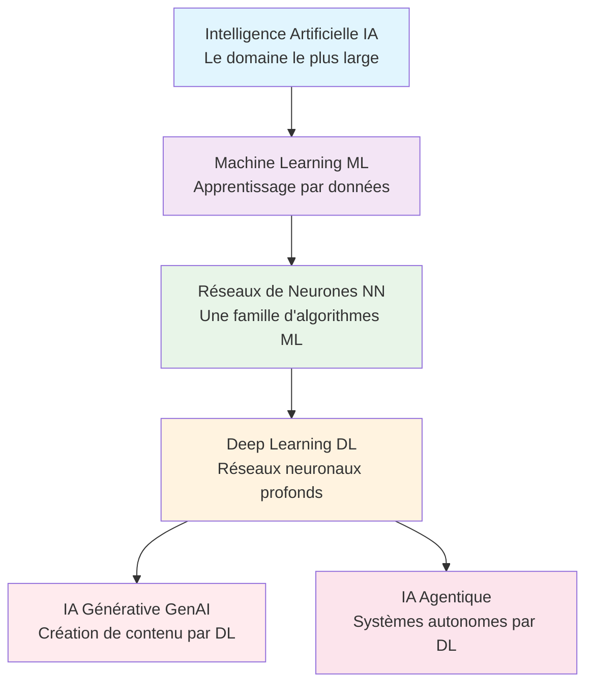
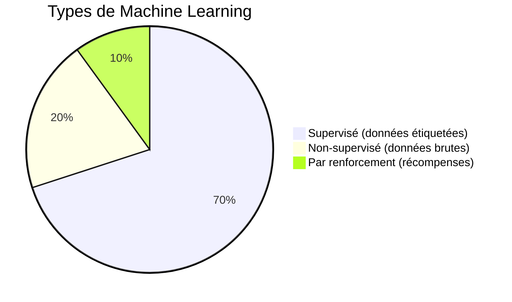
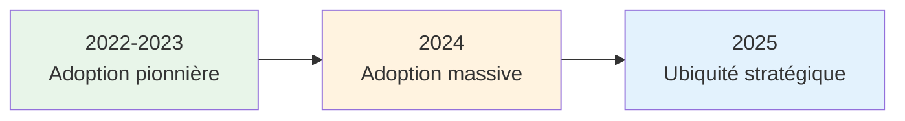
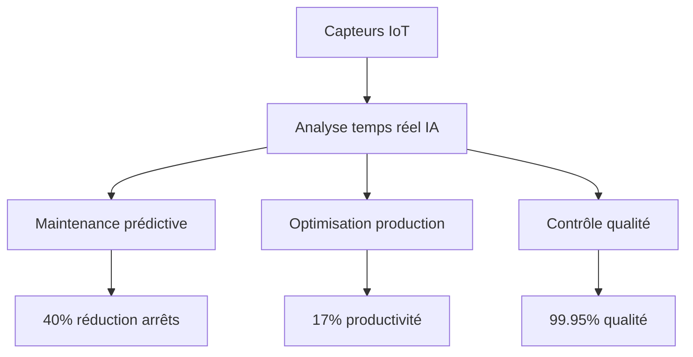
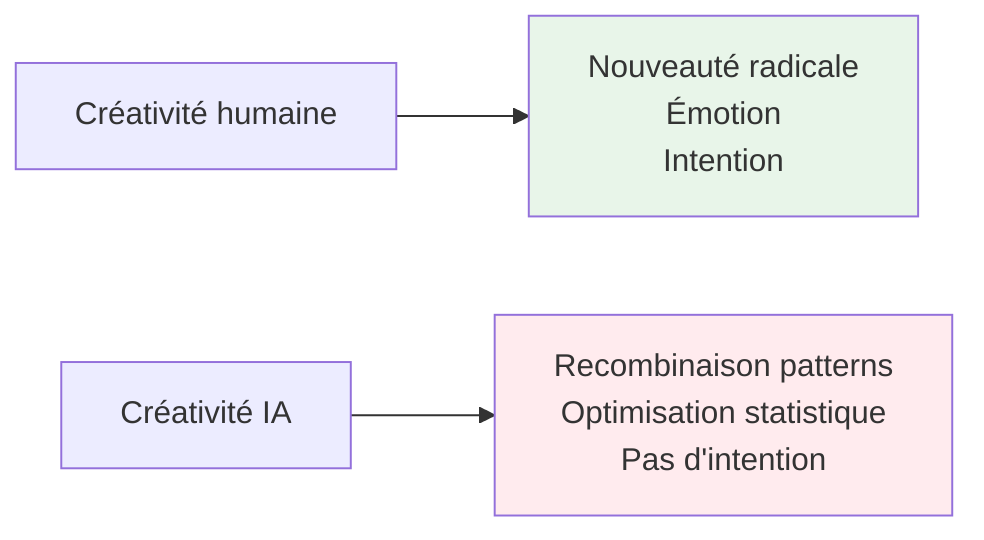
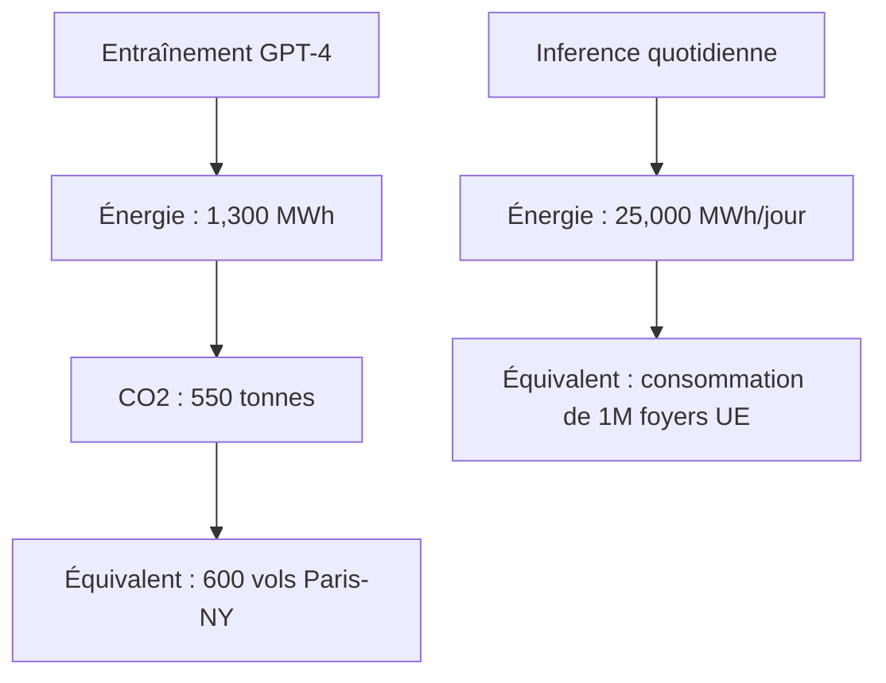

# Module 3 — Chapitre 1 : Introduction à l'IA et au Machine Learning

**Durée totale : 8h** | **Track : ML Practitioner**

---

## 🎯 Objectifs d'apprentissage

À la fin de ce chapitre, vous serez capable de :

1. **Expliquer** ce qu'est l'intelligence artificielle et la distinguer du Machine Learning et du Deep Learning
2. **Identifier** le type d'apprentissage approprié (supervisé, non-supervisé, par renforcement) pour un problème métier donné
3. **Évaluer** les implications éthiques et les limites des systèmes d'IA dans des contextes réels

---

## 🔥 Accroche : Le problème qui a tout changé

> **En mars 2016, quelque chose d'« impossible » s'est produit.**

Lee Sedol, champion du monde du jeu de Go, affronte AlphaGo, une intelligence artificielle développée par DeepMind. Le Go est considéré comme le jeu de stratégie le plus complexe au monde — plus de positions possibles qu'il n'y a d'atomes dans l'univers. Les experts prédisaient qu'aucune machine ne pourrait battre un champion humain avant au moins 10 ans.

**Résultat : AlphaGo gagne 4 parties à 1.**

Ce n'était pas de la chance. La machine avait *appris* à jouer en analysant des millions de parties, puis en jouant contre elle-même. Elle a même inventé des coups que les humains n'avaient jamais imaginés.

*Source : [Timeline of Artificial Intelligence - Wikipedia](https://en.wikipedia.org/wiki/Timeline_of_artificial_intelligence)*

**❓ Question de départ :** Comment une machine peut-elle « apprendre » quelque chose qu'aucun humain ne lui a explicitement enseigné ?

---

# Leçon 1.1 : Qu'est-ce que l'IA ?

**Durée : 1h30** | **Type : Théorie + Discussion**

---

## 🔗 Lien avec vos acquis (Module 2)

Dans le Module 2, vous avez appris à :
- Extraire des données de sources variées (CSV, API, SQL)
- Nettoyer et transformer ces données
- Les analyser avec pandas et les visualiser

**Maintenant, la question est :** que faire *après* avoir préparé ces données ? Comment passer de l'analyse descriptive (« que s'est-il passé ? ») à l'analyse prédictive (« que va-t-il se passer ? ») ?

C'est exactement là qu'intervient le **Machine Learning**.

---

## 1.1.1 Histoire de l'IA : De Turing à ChatGPT

### La question fondamentale (1950)

"Avant de parler d’applications concrètes, il faut qu’on se mette d’accord sur ce qu’on entend par intelligence artificielle.

La définition officielle parle de 'machines capables de simuler l’intelligence humaine' — c’est vrai, mais c’est assez abstrait.

Tout commence par une question philosophique posée par **Alan Turing** en 1950 dans son article *"Computing Machinery and Intelligence"* :

> **« Les machines peuvent-elles penser ? »**

Pour y répondre, Turing propose un test : si une machine peut converser avec un humain sans que celui-ci puisse déterminer s'il parle à une machine ou à un humain, alors on peut considérer que la machine « pense ».

C'est le célèbre **Test de Turing**.

*Source : [The History of AI - Coursera](https://www.coursera.org/articles/history-of-ai)*

---

<details>
<summary>🤔 Question Socratique : Pourquoi le Test de Turing est-il encore débattu aujourd'hui ?</summary>

### 🔑 Réponse

Le Test de Turing mesure la capacité d'une machine à **imiter** le comportement humain, pas nécessairement à **comprendre**. Un système comme ChatGPT peut passer le test en générant des réponses convaincantes, mais cela ne prouve pas qu'il « comprend » réellement ce qu'il dit.

C'est la différence entre :
- **Intelligence simulée** : imiter les apparences de l'intelligence
- **Intelligence réelle** : comprendre véritablement le sens et le contexte

En réalité, l’IA, c’est simplement un ensemble d’outils ou d’algorithmes capables d’analyser des données, d’apprendre de ces données, et ensuite de prendre des décisions ou produire du contenu sans qu’un humain ait à tout programmer.
L’IA n’est pas magique. Elle ne pense pas. Elle imite des processus humains — comme le raisonnement, la planification, la reconnaissance d’images ou le langage naturel.
Quand on utilise ChatGPT, par exemple, il ne “comprend” pas comme un humain, mais il reconnaît des schémas linguistiques et génère une réponse cohérente en fonction du contexte.
Donc quand on parle d’IA dans l’entreprise, on parle avant tout de machines qui apprennent à faire ce que nous faisons déjà, mais souvent plus vite, à plus grande échelle, et avec moins d’erreurs."


Ce débat reste ouvert et constitue l'un des grands mystères de la philosophie de l'IA.

</details>

---

### Les grandes étapes de l'IA

| Année | Événement | Signification |
|-------|-----------|---------------|
| **1950** | Test de Turing | La question fondamentale est posée |
| **1956** | Conférence de Dartmouth | Naissance officielle de l'IA comme discipline |
| **1958** | Perceptron | Premier réseau de neurones artificiel |
| **1997** | Deep Blue bat Kasparov | L'IA maîtrise les échecs |
| **2016** | AlphaGo bat Lee Sedol | L'IA maîtrise l'intuition au Go |
| **2017** | Article "Attention Is All You Need" | Invention des Transformers |
| **2022** | Lancement de ChatGPT | L'IA générative devient accessible au grand public |

*Source : [AI History Timeline - EdrawMind](https://edrawmind.wondershare.com/history/ai-history-timeline.html)*

"On parle beaucoup de l’intelligence artificielle aujourd’hui, comme si c’était une révolution récente…
 En réalité, c’est une idée ancienne de plus de 80 ans, née bien avant Internet ou les ordinateurs modernes.
1940 – Alan Turing et les bases de l’IA
"Tout commence dans les années 1940 avec Alan Turing, un mathématicien britannique.
 C’est lui qui a posé la question : ‘Une machine peut-elle penser ?’
Il imagine déjà un concept fondamental : une machine capable d’exécuter n’importe quelle tâche logique, à condition qu’on lui donne les bonnes instructions.
C’est à cette époque qu’on voit les premiers algorithmes, mais l’IA reste purement théorique."
Turing a aussi contribué au décryptage d’Enigma pendant la Seconde Guerre mondiale 
1956 – Naissance officielle du terme "intelligence artificielle"
"En 1956, lors d’une conférence à Dartmouth, aux États-Unis, un petit groupe de chercheurs fonde ce qu’on appelle officiellement 'l’intelligence artificielle'.
À ce moment-là, on pense que les machines vont bientôt égaler le cerveau humain — c’était un rêve un peu naïf, mais visionnaire.
Les premiers programmes arrivent, capables de jouer aux échecs ou de résoudre de petits problèmes logiques."
1970 – Premières tentatives d’IA et de compréhension du langage
"Dans les années 70, on assiste aux premières tentatives de création d’IA appliquée, notamment autour du langage naturel.
Nous sommes en 1966 lorsque Joseph Weizenbaum, chercheur au MIT, développe ELIZA, un programme capable de simuler une conversation avec un psychothérapeute rogerien.
ELIZA fonctionnait de manière assez simple : plutôt que de les formuler à voix haute, l’utilisateur tapait ses problèmes à l’écrit avant de les envoyer à la machine. ELIZA reformulait alors son entrée, ou piochait dans une banque de réponses préprogrammées pour relancer la discussion. Le but de Weizenbaum avec son invention ? Montrer les limites de la machine. Problème ? Il a surtout mis en lumière celles des humains, puisque nombreux sont ceux qui se sont attachés à leur psy artificiel, pensant même qu’ils conversaient avec un véritable être humain, ou tout du moins, avec une machine réellement intelligente…

Toujours est-il que ce programme est aujourd’hui considéré comme le premier chatbot de l’histoire, et qu’il a permis de prouver qu’un ordinateur pouvait interagir en langage naturel. Cela a d’ailleurs donné naissance à toute une branche de la recherche en IA : le traitement automatique du langage naturel (TALN).

🔗 1990 – Apparition des réseaux neuronaux et du deep learning
"Dans les années 90, on change de dimension.
 Les chercheurs s’inspirent du fonctionnement du cerveau humain : les neurones, les connexions, l’apprentissage par répétition.
C’est là qu’apparaissent les réseaux neuronaux artificiels, qu’on appelle aujourd’hui deep learning.
Le problème, à l’époque, c’est que les ordinateurs n’étaient pas encore assez puissants ni les données assez nombreuses. Donc les modèles restaient limités."
♟️ 1997 – Deep Blue bat le champion du monde d’échecs
"Et puis arrive un tournant symbolique : 1997, l’ordinateur Deep Blue d’IBM bat Garry Kasparov, le champion du monde d’échecs.
Après plusieurs années de passages à vide (ce que l’on appelle les « hivers de l’IA »), 

### L'« Hiver de l'IA » : Pourquoi l'IA a failli disparaître

Entre les années 1970 et 2000, l'IA a connu plusieurs périodes de déception appelées **« hivers de l'IA »**. Les promesses excessives des chercheurs n'ont pas été tenues, les financements se sont taris, et le domaine a stagné.

c’est grâce aux échecs que la recherche sur l’IA va connaître un coup de boost. Dans les années 1990, IBM commence en effet à travailler sur un supercalculateur spécialisé dans ce jeu. L’objectif ? Que la machine batte Kasparov, l’un des plus grands champions du monde d’échecs de tous les temps.

Après une première tentative ratée en 1996, en 1997, l’évolution du superordinateur permet à Deep Blue de prendre sa revanche et de battre Kasparov. C’est une première historique : jamais une machine n’avait battu un humain au plus haut niveau et dans un jeu aussi complex
Mais attention : Deep Blue ne 'pensait' pas — il calculait simplement toutes les combinaisons possibles beaucoup plus vite que l’humain, une puissance de calcul phénoménale, qui lui permet d’analyser 200 millions de coups par seconde pour identifier la meilleure option.

C’est un exploit de calcul, pas encore une vraie intelligence.
 Ce sera différent 20 ans plus tard, avec AlphaGo et ChatGPT, quand les machines apprendront par elles-mêmes."

 2006 - L’IA renaît de ses cendres grâce à l’envolée du Big Data et au retour en force du Deep Learning

Après les désillusions des années 1990, la victoire de Deep Blue a relancé en fanfares la recherche sur l’intelligence artificielle. Et en 2006, un double événement va lui donner un coup de fouet décisif.

D’un côté, les volumes de données produits explosent. En cause : la démocratisation d’Internet, la naissance et la popularisation des réseaux sociaux, mais aussi l’apparition de la 3G et des premiers smartphones. Et ça tombe bien, parce qu’au même moment, le projet Hadoop devient open source, permettant pour la première fois de stocker des montagnes de données pour pouvoir les traiter efficacement. On parle alors de Big Data.

L’envolée de la Data permet à Geoffrey Hinton, un chercheur canadien longtemps marginalisé pour ses travaux sur les réseaux de neurones, de revenir sur le devant de la scène. Il relance le concept de Deep Learning (ou apprentissage profond), une technique qui tente d’imiter les mécanismes d’apprentissage du cerveau humain, et que l’on peut enfin mettre en œuvre grâce aux immenses quantités de données désormais disponibles (mais aussi grâce à la puissance des nouvelles cartes graphiques).
C’est la base de tout ce qu’on connaît aujourd’hui : les assistants vocaux, les traducteurs automatiques, les chatbots. Google Translate, Siri, ou le correcteur automatique de Word — ce sont déjà des IA basées sur le TAL

Résultat ? Ce que l’on avait relégué aux tiroirs quelques années plus tôt devient la technologie star des années 2010, et le Deep Learning est à l’origine de la plupart des avancées majeures en intelligence artificielle qui vont suivre.

2012 - AlexNet fait un carton sur ImageNet grâce au Deep Learning

Geoffrey Hinton a trouvé ses successeurs puisqu’en 2012, ce sont les élèves dont il est directeur de thèse qui vont faire basculer le monde de l’IA dans une nouvelle ère.

Chaque année, le challenge ImageNet met à l’épreuve des algorithmes chargés d’identifier des objets dans des millions de photos. Jusque-là, les meilleurs modèles plafonnaient. Mais ça, c’était jusqu’à l’arrivée d’AlexNet, un réseau de neurones développé par Alex Krizhevsky et Ilya Sutskever sous la direction de Geoffrey Hinton.

Leur modèle ne se contente pas de gagner ce concours de reconnaissance d’images : il pulvérise les scores, et fait 10,8 % d’erreurs en moins que le deuxième. Une claque, et surtout un succès largement dû au Deep Learning et à l’utilisation de GPU pour l'entraînement de ce modèle.

Mais ce résultat confirme surtout ce que certains pressentaient déjà : les réseaux de neurones profonds sont redoutablement efficaces.

À partir de là, tout s’accélère, et le Deep Learning s’invite partout : dans la vision par ordinateur, le traitement du langage, la reconnaissance vocale, les voitures autonomes, et même dans nos smartphones.

2016 - AlphaGo bat Lee Sedol : l’IA domine dans un jeu que l’on pensait trop complexe pour elle

Pendant des années, le jeu de Go était considéré comme la dernière frontière. Il avait en effet tellement de subtilités qu’aucune IA n’aurait dû pouvoir rivaliser avec les meilleurs joueurs humains. Et pourtant…

En 2016, AlphaGo, une intelligence artificielle développée par DeepMind, affronte Lee Sedol, l’un des plus grands joueurs de Go de l’histoire. Le verdict ? 4–1. Mais pas pour l’humain. Pour la machine. Un choc mondial.

Ce qui rend AlphaGo si redoutable, c’est sa stratégie hybride, qui combine des réseaux de neurones pour évaluer les positions des pierres, et un algorithme de parcours qui lui permet de déterminer les meilleurs coups.

Ce match a une nouvelle fois montré que l’IA pouvait briller dans des domaines qu’on pensait réservés à l’intuition humaine, mais a aussi permis de prouver la puissance des modèles hybrides.


2018 - BERT : Google marque une nouvelle étape dans l’histoire de l’IA avec son modèle basé sur les Transformers

En 2018, Google dévoile un nouveau modèle de traitement du langage naturel qui va tout bouleverser : BERT.
Les Transformers, eux, sont à l’origine des modèles de langage modernes — comme GPT.
 Ils permettent à une IA de traiter des phrases entières en parallèle, et donc de comprendre le contexte d’un texte, pas juste les mots isolés.

Son nom (pour Bidirectional Encoder Representations from Transformers) peut paraître barbare, mais l’idée derrière est brillante. Contrairement aux modèles précédents, BERT lit une phrase dans les deux sens, de gauche à droite… et de droite à gauche.

Et ce détail change tout, car pour comprendre le sens d’un mot, il faut tenir compte de ce qui l’entoure : ce qui vient avant, mais aussi ce qui suit. Grâce à cette lecture bidirectionnelle, BERT peut analyser finement le contexte d’une phrase, d’un mot, ou même d’une question.

Résultat ? Des réponses plus précises, une compréhension plus naturelle, et une amélioration notable de Google Search. BERT devient ainsi rapidement la base des modèles NLP modernes et marque un tournant dans l’histoire de l’intelligence artificielle.

2020 - GPT-3 inaugure l’ère des grands modèles de langage (LLMs)

En 2020, OpenAI dévoile un modèle qui va propulser l’intelligence artificielle dans une toute nouvelle dimension : GPT-3. Ce qui impressionne le plus ? La taille de ce modèle de langage, puisqu’avec 175 milliards de paramètres, GPT-3 devient le plus grand modèle de langage jamais entraîné.

Il peut rédiger un texte, résumer un article ou traduire une phrase, le tout à partir d’un simple prompt. Et c’est justement là la nouveauté : GPT-3 alimente alors Chat GPT, un agent conversationnel que tout le monde peut faire fonctionner à partir de quelques lignes de consigne en langage naturel. Cette capacité donne naissance à une nouvelle compétence : le Prompt Engineering, que l’on pourrait traduire par l’art de parler à une IA pour obtenir ce que l’on veut.

Résultat ? Pour la première fois, l’IA devient accessible au grand public. Plus besoin d’être chercheur ou codeur pour l’utiliser, il suffit de savoir formuler les bons prompts. Une véritable révolution !
🚀 Today – L’ère des IA génératives (2022–2025)
2024-2025 - La course aux LLMs est lancée : GPT-4o, Claude 3, Gemini… qui deviendra la meilleure IA générative de l’histoire ?
Les GAN, ou Generative Adversarial Networks, permettent à deux IA de s’affronter — l’une crée, l’autre évalue.
 C’est grâce à ça qu’on peut aujourd’hui générer des visages réalistes, des œuvres d’art, ou des maquettes de produits.
Avec la sortie de ChatGPT en novembre 2022 et sa popularisation, les géants de la tech se sont lancés dans une course. L’objectif : être les premiers à proposer un assistant basé sur l’IA générative le plus complet possible.

Entre 2024 et 2025, on a ainsi vu les Deeptech comme OpenAI, Anthropic, Google, ou encore l’entreprise d’IA française Mistral AI, se lancer dans la course aux assistants IA multimodaux.

Presque chaque mois, un nouveau modèle est ainsi dévoilé par les géants de la tech, et ils sont à chaque fois de plus en plus poussés et complets. Aujourd’hui, ils ne se contentent plus de lire ou d’écrire : ils voient, entendent, parlent et raisonnent même. Le but ? Devenir l’assistant IA universel parfaitement intégré à nos outils du quotidien, peu importe nos usages et nos besoins.

Mais développer un assistant IA universel n’est pas l’objectif final de ces géants. Non, ce qu’ils souhaitent réellement à travers cette course, c’est d’être les premiers à réussir à développer une AGI, une IA qui serait capable de nous égaler, voire de nous surpasser, dans tous les domaines.


GPT (OpenAI) : le plus connu, qui génère du texte, des e-mails, des idées, du code.


Gemini (Google) : concurrent direct, très intégré à l’écosystème Google Workspace.


DALL·E et Midjourney : créent des images à partir de texte — utilisées dans la publicité, le design, le e-commerce.


Copilot (Microsoft) : intégré à Word, Excel, Outlook — automatise les tâches du quotidien.


Mistral (France) : alternative européenne, open source, plus légère et adaptée aux PME.


Claude (Anthropic) : IA axée sur la fiabilité et la compréhension fine des textes longs.


LE BOOM DE L’IA (générative), pourquoi maintenant?
"Alors pourquoi ce boom de l’IA maintenant ?
Après tout, on a vu que l’IA existait depuis les années 50…
Réponse
 Ce qui change aujourd’hui, c’est la réunion de trois conditions qui n’avaient jamais été réunies avant :


🧾 1. Toujours plus de données
"L’intelligence artificielle apprend à partir des données.
 Plus on lui en donne, plus elle devient performante.
Aujourd’hui, on estime que 90 % des données mondiales ont été créées au cours des deux dernières années.
Chaque photo publiée sur Instagram, chaque vidéo TikTok, chaque e-mail, chaque facture ou capteur industriel génère des données exploitables.
Les modèles comme ChatGPT ont été entraînés sur des milliards de textes, d’images et de lignes de code.
Ce volume massif permet enfin aux machines de comprendre le langage humain, reconnaître des objets, créer du contenu…
Et pour les PME, c’est une opportunité : elles produisent elles aussi des données — ventes, clients, comptabilité, maintenance — qu’elles peuvent valoriser."


⚙️ 2. Toujours plus de puissance de calcul
"Le deuxième facteur, c’est la puissance de calcul.
Former une IA, c’est comme entraîner un cerveau — il faut des milliers d’opérations par seconde.
Il y a 15 ans, c’était réservé aux géants comme Google ou IBM.
 Aujourd’hui, grâce au cloud computing, n’importe quelle PME peut louer des serveurs très puissants à la demande pour quelques euros de l’heure.
Le coût de calcul a été divisé par 1000 en dix ans, ce qui a complètement démocratisé l’accès à l’IA."
🟢 Exemples récents :
Les cartes graphiques NVIDIA ont rendu possible le deep learning à grande échelle.


Les plateformes comme AWS, Azure ou Google Cloud permettent à des start-ups de tester des modèles IA sans infrastructure interne.


🧠 3. Toujours plus d’innovations et d’infrastructures
"Le troisième levier, c’est l’innovation technologique.
Entre 2014 et aujourd’hui, la recherche en IA a connu un essor sans précédent :
de nouveaux algorithmes comme les Transformers,


et surtout l’arrivée du cloud et des API d’IA prêtes à l’emploi.


Autre point clé : la qualité et la disponibilité des modèles.
 Avant, il fallait des data scientists pour tout construire.
 Aujourd’hui, vous pouvez intégrer un modèle dans votre entreprise sans écrire une seule ligne de code, simplement via un outil SaaS."
🟢 Exemples à citer :
ChatGPT, Claude, Gemini → accessibles via navigateur, aucun prérequis technique.


Copilot dans Excel → automatisation de l’analyse de données pour tous.


Mistral AI → modèle open source français adopté par des PME et start-ups pour leurs propres produits.


Notion AI ou HubSpot AI → IA intégrée directement dans des outils du quotidien.


Frise
L’IA n’est pas nouvelle, .n’explose pas par hasard  elle mûrit depuis 80 ans
"Ce qui est nouveau, ce n’est pas l’intelligence artificielle en soi. c’est la puissance de calcul, le volume de données, et les modèles open source accessibles à tous.
 En 2025, une PME avec un ordinateur et une connexion Internet peut accéder à des outils de même puissance que ceux utilisés par les grands groupes.

---


> 💡 **Insight clé :** L'IA d'aujourd'hui n'est pas « plus intelligente » que celle des années 1960 — elle a simplement accès à beaucoup plus de données et de puissance de calcul.

---

## 1.1.2 Définitions : IA vs ML vs DL vs GenAI

### **Comprendre les relations : Une hiérarchie de spécificité**

**Schéma principal : Du général au spécifique**



**Relation clé :** Chaque niveau est un **sous-ensemble** du niveau précédent.  
Tout le GenAI est du DL, tout le DL est basé sur des NN, tous les NN sont du ML, et tout le ML est de l'IA.

---

### **1. 🤖 Intelligence Artificielle (IA) : Le domaine parent**

#### **Définition**
> Elle est définie par Marvin Minsky comme étant « la science qui consiste à faire faire aux machines des choses qui nécessiteraient de l’intelligence si elles étaient réalisées par des hommes ».

#### **Deux grandes approches historiques**

IA Symbolique (GOFAI - Good Old-Fashioned AI) : Basée sur des règles et logiques formelles
Systèmes experts
Arbres de décision programmés manuellement
Logique propositionnelle

IA Subsymbolique : Basée sur l'apprentissage à partir des données
Réseaux de neurones
Algorithmes évolutionnaires
Approches connexionnistes

#### **Exemples concrets**
- **Système basique** : Thermostat programmable (règles "si-alors")
- **Système expert** : Assistant de diagnostic médical (base de connaissances)
- **Algorithmique** : Calculateur d'itinéraire (A* algorithm)

#### **Ce qu'il faut retenir**
- L'IA **n'a pas besoin d'apprendre** pour exister 
- Peut être purement basée sur des règles logiques
- Objectif final : reproduire ou augmenter les capacités cognitives humaines
- Branches multiples : vision par ordinateur, traitement du langage, robotique, planification...

Limite importante : Une IA n'est pas nécessairement "intelligente" au sens humain ; elle peut simplement simuler des aspects de l'intelligence.

---

### **2. 📊 Machine Learning (ML) : La révolution de l'apprentissage**

#### **Définition**
> Sous-domaine de l'IA où les systèmes **apprennent et s'améliorent** à partir de données, sans être explicitement reprogrammés.

#### **Le changement de paradigme**

| Programmation traditionnelle | Machine Learning |
|-----------------------------|------------------|
| **Données** + **Règles** → **Réponses** | **Données** + **Réponses** → **Règles** |

#### **Les 3 types d'apprentissage**



##### **A. Apprentissage Supervisé** (Le plus courant)
- **Données** : Input + Output attendu
- **Exemple** : Photo de chat → Étiquette "chat"
- **Applications** : Classification (spam), Régression (prix)

##### **B. Apprentissage Non-Supervisé**
- **Données** : Input seulement
- **Objectif** : Découvrir des patterns cachés
- **Applications** : Clustering (segmentation clients), Réduction de dimension

##### **C. Apprentissage par Renforcement**
- **Mécanisme** : Essai-erreur avec récompenses/pénalités
- **Exemple** : Apprendre à jouer aux échecs
- **Applications** : Robotique, Jeux vidéo

#### **Algorithmes ML classiques** (sans NN)
- Forêts aléatoires (Random Forests)
- Machines à vecteurs de support (SVM)
- Régression linéaire/logistique
- K-means (clustering)

#### Exemples concrets détaillés :
- Filtre anti-spam : Analyse des caractéristiques (mots-clés, expéditeur, structure) et mise à jour continue de ses critères
- Recommandation Netflix : Combine filtrage collaboratif (utilisateurs similaires) et filtrage basé sur le contenu
- Prédiction immobilière : Identifie des corrélations complexes entre superficie, localisation, année, etc.

#### Caractéristiques distinctives :
- Nécessite des données en quantité suffisante
- Performance s'améliore avec l'expérience (plus de données)
- Généralise à partir d'exemples plutôt que d'exécuter des instructions fixes
- Problème fondamental : le compromis biais-variance et le risque de surapprentissage
---

### **3. 🧠 Réseaux de Neurones (NN) : Inspiration biologique**

#### **Définition**
> Famille d'algorithmes de ML directement inspirés du fonctionnement des neurones biologiques.

#### **Analogie avec le cerveau humain**

| Cerveau biologique | Réseau de neurones artificiel |
|-------------------|-------------------------------|
| Neurones | Nœuds/unités de calcul |
| Synapses | Poids/connections |
| Apprentissage | Ajustement des poids |
| Signal électrique | Valeur numérique |

#### **Structure de base d'un neurone artificiel**

```
Inputs → [ ∑(inputs × poids) + biais → Fonction d'activation ] → Output
```

#### **Réseau simple (Perceptron multicouche)**
```
┌─────────┐    ┌─────────┐    ┌─────────┐
│ Input   │    │ Couche  │    │ Output  │
│ Couche  │───→│ Cachée  │───→│ Couche  │
│ (ex: 10 │    │ (ex: 5  │    │ (ex: 3  │
│  pixels)│    │ neurones)│    │ classes)│
└─────────┘    └─────────┘    └─────────┘
```

---

### **4. 🔍 Deep Learning (DL) : La puissance de la profondeur**

#### **Définition**
> Sous-ensemble spécialisé du ML utilisant des architectures de réseaux de neurones artificiels comportant de multiples couches de traitement (d'où "deep"), permettant l'apprentissage de représentations hiérarchiques et abstraites à partir de données brutes.

#### **Pourquoi "Deep" fait la différence**

| Réseau peu profond (ML classique) | Deep Learning |
|-----------------------------------|---------------|
| 1-2 couches cachées | 10 à 1000+ couches |
| Caractéristiques définies manuellement | Caractéristiques apprises automatiquement |
| Limité en complexité | Extrêmement puissant pour données complexes |

#### **Architectures DL principales**

##### **A. CNN - Réseaux Neuronaux Convolutionnels**
- **Spécialité** : Spécialisés pour les données grid-like (images, son, vidéos)
- **Idée clé** : Utilisent des filtres convolutionnels pour détecter des caractéristiques hiérarchiques
- **Exemple** :  Couche 1 détecte les bords → Couche 2 détecte les formes → Couche 3 détecte les objets,  Reconnaissance faciale, détection d'objets

##### **B. RNN/LSTM - Réseaux Récurrents**
- **Spécialité** : Données séquentielles (texte, séries temporelles)
- **Idée clé** : Mémoire des états précédents
- **Exemple** : Prédiction de texte, traduction

##### **C. Transformers** (Révolution récente)
- **Spécialité** : Spécialisés pour les données séquentielles (texte, séries temporelles)
- **Idée clé** : Attention mechanism (comprendre les relations) Mémoire des états précédents
- **Exemple** : GPT, BERT, modèles de langage

#### **Exemple concret :**

Reconnaissance faciale :

Couche 1 → détection des contours
Couche 2 → détection des yeux, nez, bouche
Couche 3 → reconnaissance des arrangements spatiaux
Couche 4 → identification de la personne

Traduction automatique :

Encoder transforme la phrase source en représentation vectorielle
Decoder génère la phrase cible à partir de cette représentation
Attention mechanisme permet de focaliser sur les parties pertinentes

Caractéristiques et implications :

Avantages : Performance exceptionnelle sur tâches complexes, réduction de l'ingénierie manuelle
Coûts : Nécessite énormément de données et de puissance de calcul (GPU/TPU)
Problèmes : Boîte noire (interprétabilité difficile), risque de biais dans les données

#### Pourquoi "Deep" fait la différence :

- Apprentissage de caractéristiques automatique : Plus besoin d'ingénierie manuelle des features
- Représentations hiérarchiques : Des caractéristiques simples se combinent en représentations complexes
- Capacité d'abstraction croissante à travers les couches
---

### **5. 🎨 IA Générative (GenAI) : Créer plutôt que classifier**

#### **Définition**
> Sous-ensemble du Deep Learning spécialisé dans la **création de nouveau contenu** (texte, images, musique, code).

#### **DL Discriminatif vs Génératif**

| Discriminatif (classique) | Génératif (GenAI) |
|---------------------------|-------------------|
| "Est-ce un chat ou un chien?" | "Dessine-moi un chat" |
| Classification, Prédiction | Création, Imagination |
| Reconnaître des patterns | Générer de nouveaux patterns |
| Ex: Détection de spam | Ex: ChatGPT, DALL-E |

#### **Technologies GenAI principales**

##### **A. Modèles de Langage (LLMs)**
- **Exemples** : GPT-4, Claude, Llama
- **Fonctionnement** : Prédiction du mot suivant
- **Applications** : Chatbots, rédaction, code

##### **B. Modèles de Diffusion**
- **Exemples** : DALL-E, Stable Diffusion, Midjourney
- **Fonctionnement** : Ajout/suppression de bruit progressif
- **Applications** : Génération d'images, vidéos

##### **C. Modèles Autoregressifs**
- **Fonctionnement** : Génération séquentielle (un élément à la fois)
- **Applications** : Musique, texte, séries temporelles

#### **Les Foundation Models**
> Modèles massivement pré-entraînés sur des données énormes, pouvant être adaptés à de nombreuses tâches.

**Caractéristiques** :
- Entraînement sur internet entier (textes, images)
- Capacité de "zero-shot learning" (comprendre sans exemples)
- Coût d'entraînement : millions de dollars
- Exemples : GPT-4, Gemini, Claude 3

---

### **6. 🤖 IA Agentique : La prochaine frontière**

#### **Définition**
> Systèmes d'IA autonomes capables de **planifier et exécuter des tâches complexes** en interagissant avec leur environnement.

#### **Capacités des agents IA**
1. **Planification** : Décomposer un objectif en étapes
2. **Outillage** : Utiliser des outils externes (API, calculatrice)
3. **Mémoire** : Se souvenir des interactions passées
4. **Auto-amélioration** : Apprendre de ses erreurs

#### **Exemples d'agents**
- Assistant personnel autonome (planifier vos vacances)
- Agent de trading algorithmique
- Robot domestique intelligent
- Assistant de recherche scientifique

---

### **📊 Tableau synthèse : Qui fait quoi ?**

| | IA | ML | NN | DL | GenAI |
|--|----|----|----|----|-------|
| **Définition** | Systèmes "intelligents" | Apprendre de données | Algorithmes inspirés du cerveau | NN avec plusieurs couches | Créer du contenu |
| **Relations** | Domaine parent | Sous-domaine de l'IA | Type d'algorithme ML | Type spécifique de NN | Application du DL |
| **Données** | Optionnelles | Requises | Requises | Beaucoup requises | Énormément requises |
| **Calcul** | Variable | Modéré | Élevé | Très élevé | Extrêmement élevé |
| **Exemple simple** | Thermostat intelligent | Filtre anti-spam | Reconnaissance de chiffres | Reconnaissance faciale | ChatGPT |
| **Force principale** | Logique/raisonnement | Patterns statistiques | Modèles non-linéaires | Représentations complexes | Créativité/innovation |

---

### **🎯 Guide pratique : Quel outil pour quel problème ?**

### **Choisissez...**
- **IA traditionnelle** : Pour des règles métier claires et stables
- **ML classique** : Pour des données structurées, besoin d'interprétabilité
- **Deep Learning** : Pour des données complexes (images, texte, son)
- **GenAI** : Pour créer du contenu ou dialoguer naturellement
- **IA Agentique** : Pour automatiser des processus complexes multi-étapes

### **Questions à se poser**
1. **Quel type de données ?** (structurées, images, texte)
2. **Quel objectif ?** (classer, prédire, créer, automatiser)
3. **Combien de données ?** (peu, beaucoup, énormément)
4. **Besoin d'explicabilité ?** (critique, important, secondaire)
5. **Ressources disponibles ?** (CPU, GPU, budget)

---

### **💡 Points clés à retenir**

1. **Hiérarchie inclusive** : GenAI ⊂ DL ⊂ NN ⊂ ML ⊂ IA
2. **Plus on descend, plus c'est spécialisé** (et souvent puissant)
3. **Le "meilleur" outil dépend du problème**, pas de la technologie
4. **L'IA ne remplace pas l'intelligence humaine** : Elle l'augmente
5. **L'évolution est rapide** : Ce qui est vrai aujourd'hui peut changer demain

### **Métaphore finale**
Pensez à la construction d'une maison :
- **IA** = L'idée de "maison"
- **ML** = Les techniques de construction modernes
- **NN** = L'utilisation de briques et ciment
- **DL** = Les gratte-ciels (beaucoup de couches)
- **GenAI** = La capacité de concevoir de nouveaux styles architecturaux
- **IA Agentique** = Un robot qui peut construire la maison de A à Z

Chaque niveau **inclut** et **s'appuie** sur les précédents, tout en ajoutant de nouvelles capacités.

---

<details>
<summary>🤔 Question Socratique : Un GPS qui calcule le meilleur itinéraire utilise-t-il du Machine Learning ?</summary>

### 🔑 Réponse

**Pas nécessairement.** Un GPS classique utilise des algorithmes déterministes (comme Dijkstra ou A*) pour trouver le chemin le plus court. C'est de l'IA « classique » basée sur des règles.

**En revanche**, Google Maps ou Waze utilisent du Machine Learning pour :
- Prédire le trafic en temps réel
- Estimer les temps de trajet basés sur les données historiques
- Apprendre les préférences de l'utilisateur

C'est un bon exemple de la différence entre **IA basée sur des règles** et **IA basée sur l'apprentissage**.

</details>

---

### Tableau comparatif

| Concept | Définition | Relations | Données | Calcul | Exemple simple | Force principale |
|---------|------------|-----------|---------|--------|----------------|------------------|
| **IA** | Systèmes "intelligents" | Domaine parent | Optionnelles | Variable | Thermostat intelligent | Logique/raisonnement |
| **ML** | Apprendre de données | Sous-domaine de l'IA | Requises | Modéré | Filtre anti-spam | Patterns statistiques |
| **NN** | Algorithmes inspirés du cerveau | Type d'algorithme ML | Requises | Élevé | Reconnaissance de chiffres | Modèles non-linéaires |
| **DL** | NN avec plusieurs couches | Type spécifique de NN | Beaucoup requises | Très élevé | Reconnaissance faciale | Représentations complexes |
| **GenAI** | Créer du contenu | Application du DL | Énormément requises | Extrêmement élevé | ChatGPT | Créativité/innovation |

---

## 1.1.3 L'état actuel de l'IA (2024-2025) : Le Grand Saut Évolutif

### 🌍 Panorama mondial de l'adoption

#### L'explosion industrielle de l'IA

**Le basculement historique** : L'IA est passée d'une technologie de laboratoire à un pilier économique mondial en seulement 3 ans.



**Chiffres clés révélateurs** :

| Indicateur | 2023 | 2024 | 2025 (projection) | Croissance |
|------------|------|------|-------------------|------------|
| Organisations utilisant l'IA | 55% | 78% | 87% | +58% en 2 ans |
| Investissements annuels | $189B | $252B | $320B | +69% en 2 ans |
| Productivité relative | 2.1x | 4.8x | 6.5x | Triplement |
| *Sources : Stanford HAI, McKinsey, Gartner* | | | | |

#### La géopolitique de l'IA

**Trois pôles mondiaux émergents** :

1. **États-Unis** (Leadership technique et capitalistique)
   - 75% des modèles foundation de pointe
   - 68% des investissements privés mondiaux
   - Silicon Valley + Boston comme épicentres

2. **Chine** (Leadership d'adoption et de données)
   - 580 millions d'utilisateurs actifs d'applications IA
   - 40% des brevets IA mondiaux
   - Stratégie gouvernementale "IA 2030"

3. **Europe** (Leadership réglementaire et éthique)
   - AI Act : première régulation complète mondiale
   - Excellence en IA industrielle et médicale
   - 22% des publications scientifiques

---

### 🚀 Transformations sectorielles concrètes

#### La révolution documentaire (Droit, Finance, Compliance)

**Exemple approfondi : Analyse contractuelle juridique**
- **Processus traditionnel** : Un avocat junior passe 16 heures à analyser 500 pages de contrats
- **Avec l'IA actuelle** : Même tâche réalisée en 3-4 minutes avec 98,7% de précision
- **Technologie sous-jacente** : Transformers + RAG (Retrieval-Augmented Generation)
- **Impact économique** : Réduction de 92% des coûts de due diligence

**Cas réel : Harvey AI (déployé chez Allen & Overy)**
- 3,500 avocats formés à l'outil
- 40% de réduction du temps sur les recherches juridiques
- Capacité à analyser la jurisprudence de 50 pays simultanément

#### La médecine augmentée

**Deux révolutions parallèles** :

##### A. Diagnostic assisté par l'IA
```
Processus diagnostique augmenté :
1. Analyse d'image médicale → Détection de 124 pathologies (vs. 20 pour un spécialiste)
2. Croisement données patient → Prédiction de risques individuels
3. Recommandation traitement → Optimisation basée sur 2M+ de cas similaires
```

**Performance réelle en oncologie** :
- **Mélanomes** : 100% détection vs. 86% pour les dermatologues
- **Cancer du sein** : 94% précision vs. 88% pour les radiologues
- **Avantage clé** : Zero fatigue, reproductibilité parfaite

##### B. Découverte de médicaments
- **AlphaFold 3** (DeepMind) : Prédit les interactions protéine-médicament
- **Impact** : Réduction de 3-5 ans sur le développement de nouveaux médicaments
- **Exemple concret** : Découverte d'un antibiotique contre les bactéries résistantes en 48h (vs. années traditionnellement)

#### L'usine intelligente 4.0

**Pilier de la 4ème révolution industrielle** :



**Cas Siemens MindSphere** :
- 1,200 usines connectées
- 45% de réduction des temps d'arrêt
- ROI moyen : 14 mois

#### Le développement logiciel transformé

**La programmation augmentée** est devenue la norme :

| Outil | Usage quotidien | Impact productivité |
|-------|----------------|---------------------|
| GitHub Copilot | 58% des développeurs | +55% de vitesse de code |
| ChatGPT Code | 42% des développeurs | Réduction de 70% du temps de débogage |
| Claude Code | 35% des développeurs | Amélioration de 40% de la qualité du code |

**Nouveau paradigme** :
- **Développeur 2020** : 70% codage, 30% conception
- **Développeur 2025** : 30% codage, 40% prompt engineering, 30% validation

**Impact économique** : 100 millions de lignes de code générées quotidiennement par l'IA

---

### 📊 Le paysage technologique 2024-2025

#### Les modèles dominants (Le "Big Three")

```mermaid
graph BT
    A[GPT-4 Turbo<br/>128K tokens<br/>Multimodal complet] --> B[Claude 3 Opus<br/>200K tokens<br/>Raisonnement supérieur]
    B --> C[Gemini Ultra<br/>1M tokens<br/>Intégration Google]
    
    D[Open Source<br/>Llama 3, Mistral]<br/> --> A
    D --> B
    D --> C
    
    style A fill:#ffebee
    style B fill:#e8f5e9
    style C fill:#e3f2fd
    style D fill:#fff3e0
```

#### Caractéristiques des modèles 2025 :

1. **Multimodalité native** : Texte, image, audio, vidéo dans un seul modèle
2. **Contextes étendus** : Jusqu'à 1 million de tokens (≈ 750 pages)
3. **Spécialisation verticale** : Modèles spécifiques médecine, droit, finance
4. **Efficacité énergétique** : -60% consommation vs. 2022

#### L'émergence des "Small Language Models" (SLMs)

**La contre-révolution** : Des modèles plus petits mais plus efficaces

| Modèle | Taille | Performance | Cas d'usage |
|--------|--------|-------------|-------------|
| Phi-3 (Microsoft) | 3,8B paramètres | 90% de GPT-4 | Edge devices, mobiles |
| Gemma (Google) | 2B paramètres | Rapidité ×3 | Applications temps réel |
| Mistral 8x7B | 7B paramètres | Économie d'énergie | Entreprises, vie privée |

**Avantages des SLMs** :
- Coût d'entraînement : 1/1000ème des LLMs
- Exécution locale possible
- Respect vie privée (données ne quittent pas l'appareil)

---

### ⚠️ Les limites fondamentales de l'IA actuelle

#### Le paradoxe de la puissance apparente vs. compréhension réelle

**Apparences** : L'IA semble comprendre, raisonner, créer
**Réalité** : Statistiques sophistiquées × puissance de calcul

#### Les 5 déficits cognitifs de l'IA

##### 1. **Déficit de compréhension sémantique** (Le problème du sens)
```python
# L'IA voit ceci :
"Le médecin a soigné le patient avec le scalpel"

# Elle "comprend" :
Suject: médecin, Verb: soigné, Object: patient, Instrument: scalpel

# Ce qu'elle ne comprend PAS :
- La vulnérabilité du patient
- La responsabilité médicale
- L'intention de guérir
- Le contexte hospitalier
```

##### 2. **Déficit de raisonnement abductif** (Le "bon sens")
> **Humain** : "Si je vois de l'herbe mouillée, je peux déduire qu'il a plu, ou qu'on a arrosé, ou..."
> **IA** : "L'herbe est mouillée" (corrélation ≠ causalité)

**Expérience du "common sense"** :
- Test Winograd Schema : 95% humains vs. 68% meilleurs modèles IA
- Situations nouvelles : L'IA échoue à généraliser hors de ses données d'entraînement

##### 3. **Déficit de créativité authentique**


**Exemple musical** :
- **IA** : Génère une symphonie "dans le style de Beethoven"
- **Humain** : Crée un nouveau style (comme Beethoven l'a fait)
- **Différence** : L'IA extrapole, l'humain révolutionne

##### 4. **Déficit de conscience situationnelle**
**Scénario réel** : Voiture autonome face à une situation inédite
- **Données d'entraînement** : 10 millions de kilomètres
- **Situation nouvelle** : Arbre tombé + accident + enfants qui traversent
- **Réponse IA** : Surcharge probabiliste (trop de variables contradictoires)
- **Réponse humaine** : Priorisation éthique instinctive

##### 5. **Déficit émotionnel et d'empathie**
> "L'IA peut reconnaître que vous êtes triste, mais elle ne peut pas *ressentir* votre tristesse."

**Les émotions simulées vs. réelles** :
- **Reconnaissance affective** : 92% précision (voix, expressions faciales)
- **Simulation d'empathie** : Scripts prédéfinis basés sur des patterns
- **Émotion réelle** : Absente (pas de conscience, pas de subjectivité)

#### Les problèmes pratiques persistants

##### A. Hallucinations et fabulations
- **Taux d'hallucination GPT-4** : 15-20% sur des faits vérifiables
- **Cause fondamentale** : Modèle génératif, pas base de faits
- **Conséquence** : Nécessité de vérification humaine systématique

##### B. Biais et discrimination algorithmique
**Statistiques 2024** :
- Recrutement IA : 35% de biais contre les femmes dans la tech
- Prêts bancaires : Taux de refus ×2,4 pour les minorités
- Justice prédictive : Erreurs raciales dans 44% des cas

**Racine du problème** : Biais dans les données d'entraînement + optimisation pour la moyenne

##### C. Coûts environnementaux


---

### 🔮 Tendances 2025-2026 : Ce qui vient

#### 1. L'IA multimodale intégrée
- **Vision** : Un seul modèle pour tout (texte, image, son, 3D, capteurs)
- **Exemple** : GPT-5 (annoncé) promet l'intégration complète
- **Impact** : Disparition des barrières entre types de données

#### 2. L'agentivité émergente
- **Capacités** : Planification multi-étapes, usage d'outils, mémoire persistante
- **Métrique clé** : Taux d'autonomie sur tâches complexes
- **Objectif 2026** : Agents capables de gérer des projets sur 3 mois

#### 3. La personnalisation radicale
- **Fine-tuning individuel** : Modèles qui apprennent de vous en continu
- **Vie privée** : Dilemme entre personnalisation et confidentialité
- **Applications** : Éducation sur mesure, médecine personnalisée, divertissement adaptatif

#### 4. La régulation globale
- **AI Act européen** : Entrée en vigueur progressive 2024-2026
- **États-Unis** : Executive Order + législation sectorielle
- **Chine** : Règles spécifiques par type d'IA
- **Consensus émergent** : Nécessité de garde-fous pour l'IA générative

#### 5. L'IA scientifique accélérée
- **Prédiction** : 30-50% des découvertes scientifiques assistées par l'IA d'ici 2026
- **Domaines** : Matériaux, physique quantique, génomique, climatologie
- **Impact potentiel** : Compression du temps de recherche

---

### 💎 Conclusion : Le Grand Réalignement

#### La vérité fondamentale
> **"L'IA 2025 est un supercalculateur statistique, pas une intelligence artificielle générale."**

#### Le nouvel équilibre homme-machine

| Capacité | Humain supérieur | IA supérieure | Synergie optimale |
|----------|------------------|---------------|-------------------|
| Raisonnement | Contexte, éthique, bon sens | Volume, vitesse, patterns | IA propose, humain décide |
| Créativité | Innovation radicale | Variation systématique | Humain imagine, IA exécute |
| Précision | Jugement qualitatif | Mesure quantitative | IA analyse, humain interprète |
| Échelle | Relations profondes | Interactions massives | IA gère la quantité, humain la qualité |

#### Appel à la lucidité technologique

**À retenir absolument** :
1. L'IA transforme tout, mais ne remplace pas l'intelligence humaine
2. Son pouvoir vient de la reconnaissance de patterns à échelle impossible pour l'humain
3. Ses limites sont structurelles, pas temporaires
4. La valeur ajoutée humaine devient le jugement, l'éthique, la créativité authentique

**Dernière métaphore** :
> L'IA actuelle est comme un **télescope pour l'esprit** : elle voit plus loin et plus précisément que l'œil nu, mais elle ne comprend pas ce qu'elle voit. L'astronome (l'humain) doit toujours interpréter, donner du sens, et décider quoi regarder.

**Prochaine étape** : Dans 5 ans, nous ne parlerons plus d'"IA" comme technologie distincte, mais d'"intelligence augmentée" comme mode de fonctionnement standard de toute organisation et de tout professionnel.

> 💡 **Démystification :** L'IA n'est pas magique — c'est de la **reconnaissance de patterns à grande échelle**. Elle excelle à trouver des régularités dans des données massives, mais elle ne « comprend » pas ce qu'elle fait.

---

<details>
<summary>🤔 Question Socratique : Pourquoi dit-on que l'IA « ne comprend pas » si elle peut répondre correctement à des questions complexes ?</summary>

### 🔑 Réponse

**La nuance est cruciale :**

Un LLM comme ChatGPT prédit le prochain mot le plus probable basé sur des milliards d'exemples de texte. Il n'a pas de « modèle mental » du monde.

**Analogie :** Imaginez quelqu'un qui a mémorisé toutes les réponses possibles à un examen sans comprendre le sujet. Il obtiendrait 100%, mais ne pourrait pas appliquer ses connaissances à une situation nouvelle non prévue.

**Preuve :** Les LLMs peuvent échouer spectaculairement sur des problèmes simples de logique ou de mathématiques qui nécessitent un vrai raisonnement, même s'ils réussissent des tâches apparemment plus complexes.

C'est pourquoi on parle de **« perroquet stochastique »** — un système qui répète des patterns sans comprendre leur signification profonde.

</details>

---

## 📚 Encadré : Perspective alternative

### « L'IA est-elle vraiment intelligente ? »

**Point de vue 1 — Les optimistes :**
> « La différence entre imiter l'intelligence et être intelligent est peut-être une fausse distinction. Si un système se comporte de manière indiscernable d'un être intelligent, il EST intelligent. » — Position fonctionnaliste

**Point de vue 2 — Les sceptiques :**
> « Un perroquet peut répéter des phrases en français sans comprendre le français. De même, les LLMs manipulent des symboles sans comprendre leur signification. » — Position du « Chinese Room » (John Searle)

**Votre position ?** Il n'y a pas de bonne réponse définitive — ce débat anime la philosophie de l'IA depuis 70 ans.

---

## 🧠 Réflexion métacognitive

Avant de passer à la suite, prenez un moment pour réfléchir :

1. **Qu'est-ce qui vous a surpris** dans cette leçon ?
2. **Quel concept vous semble le plus flou ?** (IA vs ML vs DL ? L'histoire ? Les limites ?)
3. **Comment expliquerez-vous** la différence entre ML et DL à un collègue non-technique ?

> 📝 Notez vos réponses — nous y reviendrons à la fin du chapitre.

---

# Leçon 1.2 : Types d'apprentissage

**Durée : 2h** | **Type : Théorie + Exemples**

---

## 🔥 Accroche : Comment Netflix sait-il ce que vous voulez regarder ?

Netflix possède plus de **260 millions d'abonnés** dans le monde. Chaque utilisateur voit une page d'accueil différente, personnalisée selon ses goûts. Cette personnalisation génère **75-80% de tout ce qui est regardé** sur la plateforme.

Comment font-ils ? Ils n'ont pas 260 millions d'employés qui regardent vos habitudes. La réponse : **le Machine Learning**.

*Source : [How ML Powers Recommendation Systems - Boston Institute of Analytics](https://bostoninstituteofanalytics.org/blog/how-machine-learning-powers-recommendation-systems-netflix-amazon-spotify/)*

---

**❓ Question de départ :** Mais concrètement, comment une machine peut-elle « apprendre » vos préférences ?

---

## 1.2.1 Apprentissage supervisé

### 1.2.1.1 Regression

#### Étape 1 : Découverte par l'exemple principal

**Scénario : Prédiction des ventes d'un café**

Vous gérez un café. Chaque jour, vous notez :
- Température extérieure
- Jour de semaine ou week-end
- Événement spécial dans le quartier
- **Nombre exact de cafés vendus** (que vous connaissez car vous comptez les ventes)

**Données sur 3 jours :**
| Jour | Température | Type de jour | Événement | Cafés vendus |
|------|-------------|--------------|-----------|--------------|
| Lundi | 18°C | Semaine | Non | 120 |
| Samedi | 25°C | Week-end | Oui | 350 |
| Mercredi | 22°C | Semaine | Non | 150 |

**Question 1 :** *Si je vous montre ces données et que je vous demande "Comment feriez-vous pour prédire les ventes de demain ?", quelle serait votre première étape ?*

*(Réponse attendue : Observer les relations entre les conditions et les ventes connues)*

**Question 2 :** *Quelle information dans ce tableau vous permet de vérifier si vos prédictions seraient correctes ?*

*(Réponse attendue : La colonne "Cafés vendus" - c'est la "réponse" qu'on connaît déjà pour ces jours)*

**Question 3 :** *Comment appelle-t-on ce type d'apprentissage où on a des exemples avec les bonnes réponses ?*

---

#### Introduction du concept :

**C'est exactement cela : l'APPRENTISSAGE SUPERVISÉ.**

**Définition émergente :** 
L'apprentissage supervisé = apprendre à partir d'exemples **où la réponse correcte est déjà connue**.

Le "superviseur" = les réponses dans vos données historiques qui vous disent si vous apprenez correctement.

---

#### Étape 2 : Reconnaître d'autres cas d'apprentissage supervisé

**Exemple A : Banque - Octroi de crédit**
La banque a un historique de dossiers avec :
- Revenus du client
- Endettement
- Âge
- **Crédit accordé ou refusé** (décision passée)

**Question 4 :** *Pourquoi est-ce aussi de l'apprentissage supervisé ?*

*(Réponse attendue : Parce qu'on a des exemples passés avec la décision (la "réponse") qu'a prise la banque)*

**Exemple B : Météo - Prédiction de température**
Météo France a des archives avec :
- Pression atmosphérique
- Humidité
- Vent
- **Température enregistrée** le lendemain

**Question 5 :** *En quoi cet exemple est-il SIMILAIRE au café pour l'apprentissage supervisé ?*

*(Réponse attendue : Dans les deux cas, on connaît le résultat réel pour les situations passées)*

**Exemple C : Reconnaissance de fraude bancaire**
Le système analyse des transactions passées où on sait lesquelles étaient frauduleuses et lesquelles étaient légitimes.

---

#### Étape 3 : Le contre-exemple pour clarifier

**Scénario : Regroupement de clients**
Un marketeur regarde les données clients (âge, dépenses, fréquence d'achat) et cherche à **former des groupes naturels** sans savoir à l'avance combien de groupes il devrait y avoir.

**Question 6 :** *En quoi ce problème est-il DIFFÉRENT des précédents ?*

*(Réponse attendue : Ici, on ne connaît pas à l'avance la "bonne réponse" - on ne sait pas à quel groupe devrait appartenir chaque client)*

---

#### Étape 4 : Synthèse par les élèves

**Question finale :** *Maintenant, avec vos propres mots, comment définiriez-vous l'apprentissage supervisé à quelqu'un qui n'y connaît rien ?*

**Éléments qui doivent apparaître dans leur définition :**
1. On apprend à partir d'**exemples passés**
2. Pour ces exemples, on connaît déjà la **bonne réponse/étiquette**
3. On utilise ces exemples "corrigés" pour apprendre à prédire pour de nouvelles situations
4. Cela nécessite donc de **collecter des données étiquetées** au préalable

---

#### Étape 5 : Application immédiate

**Exercice (5 minutes en binômes) :**
*Pensez à votre domaine d'études ou à un loisir. Proposez un problème qui pourrait être résolu par apprentissage supervisé. Décrivez :*
1. *Quelles données vous collecteriez*
2. *Quelle serait "l'étiquette" ou "réponse" à connaître*
3. *Pourquoi ce serait de l'apprentissage supervisé*

---
### 1.2.1.2 Classification - Version détaillée

#### **Étape 1 : Découverte guidée par l'exemple principal**

#### **Scénario : Filtrage des emails d'une petite entreprise**

Vous êtes responsable IT d'une entreprise de 20 personnes. Chaque jour, les employés reçoivent des dizaines d'emails, et certains sont clairement du spam.

**Phase 1 - L'observation intuitive**

*Vous décidez d'analyser les emails reçus cette semaine. Pour chaque email, vous notez :*
- Contient-il le mot "gratuit" ?
- L'expéditeur est-il dans vos contacts ?
- L'email a-t-il plusieurs pièces jointes ?
- **Et surtout : les employés ont-ils marqué cet email comme SPAM ou LÉGITIME ?**

**Premiers emails analysés :**
| Email | Mot "gratuit" | Expéditeur connu | Pièces jointes | **Catégorie réelle** |
|-------|---------------|------------------|----------------|----------------------|
| 1 | OUI | NON | 0 | **SPAM** |
| 2 | NON | OUI | 1 | LÉGITIME |
| 3 | OUI | NON | 3 | **SPAM** |
| 4 | NON | OUI | 2 | LÉGITIME |
| 5 | OUI | OUI | 0 | LÉGITIME (newsletter) |

**Question 1 :** *Si un nouvel email arrive avec le mot "gratuit", d'un expéditeur inconnu, avec 1 pièce jointe, que penseriez-vous ? Pourquoi ?*

*(Laissez les élèves réfléchir 2 minutes, noter leur raisonnement)*

---

**Phase 2 - Le raisonnement pas à pas**

**Question 2 :** *Comparez les emails 1 et 3 (tous deux marqués SPAM). Qu'ont-ils en commun ?*

*(Réponse attendue : Ils contiennent le mot "gratuit" et viennent d'expéditeurs inconnus)*

**Question 3 :** *Maintenant regardez l'email 5 : il contient "gratuit" mais est marqué LÉGITIME. Pourquoi selon vous ? Quelle différence avec les emails 1 et 3 ?*

*(Réponse attendue : L'expéditeur est connu - c'est une newsletter autorisée)*

**Question 4 :** *Pouvez-vous formuler une "règle" simple basée sur ces 5 exemples ?*

---

**Phase 3 - Le type de réponse révélé**

**Question 5 :** *Dans le scénario des glaces (cours précédent), on prédisait un NOMBRE (85, 120...). Ici, que prédisons-nous ?*

**Question 6 :** *Quelle est la différence fondamentale entre "prédire 95 glaces" et "prédire SPAM" ?*

**Question 7 :** *Combien de "réponses possibles" avons-nous ici ? Pourriez-en avoir plus ?*

*(Réponse attendue : Ici seulement 2 réponses possibles - SPAM ou LÉGITIME. On pourrait avoir plus de catégories)*

---

**Phase 4 - L'étiquetage et l'apprentissage**

**Question 8 :** *Pour apprendre à classer, quelle information dans le tableau est absolument indispensable ?*

**Question 9 :** *Comment appelle-t-on cette colonne "Catégorie réelle" dans le jargon du machine learning ?*

*(Introduire le terme "étiquette" ou "label")*

**Question 10 :** *Si vous n'aviez que les 3 premières colonnes sans la catégorie, pourriez-vous apprendre à classer ? Pourquoi ?*

---

#### **Introduction solide du concept :**

**C'est la CLASSIFICATION, un type d'apprentissage supervisé.**

**Caractéristiques qui émergent :**
- On prédit une **CATÉGORIE** (pas un nombre)
- Nombre limité de réponses possibles
- Basé sur des exemples **déjà étiquetés**
- Le "superviseur" = les étiquettes correctes qu'on connaît

**La différence essentielle avec la régression :**
- Régression : "Combien ?" → réponse numérique continue
- Classification : "Quelle catégorie ?" → réponse discrète parmi des options

---

#### **Étape 2 : Consolidation avec d'autres exemples**

**Exemple A : Détection de fraude bancaire**
Votre banque analyse les transactions et les marque comme :
- **FRAUDE** (si le client a contesté)
- **LÉGITIME** (si confirmé par le client)

**Données pour chaque transaction :**
- Montant
- Heure
- Localisation
- Type de commerce
- **Étiquette : FRAUDE ou LÉGITIME**

**Question 11 :** *En quoi cet exemple est-il SIMILAIRE au filtrage d'emails ?*

**Question 12 :** *Pourquoi la banque a-t-elle besoin d'exemples étiquetés "fraude" pour apprendre ?*

---

**Exemple B : Diagnostic médical assisté**
Un logiciel aide les radiologues à analyser des images de tumeurs :

**Pour chaque image historique :**
- Taille de la lésion
- Forme
- Densité
- **Diagnostic confirmé : MALIN ou BÉNIN**

**Question 13 :** *Combien de catégories possibles ici ? Est-ce toujours une classification ?*

*(Réponse attendue : Oui, classification binaire - seulement 2 options)*

---

**Exemple C : Reconnaissance de chiffres manuscrits**
Pour automatiser la lecture de codes postaux :

**Données d'entraînement :**
- Images de chiffres 0 à 9 écrits à la main
- **Étiquette : le chiffre réel (0, 1, 2... 9)**

**Question 14 :** *Combien de catégories cette fois ? Est-ce encore de la classification ?*

*(Réponse attendue : Oui, classification multiclasse - 10 catégories possibles)*

---

#### **Étape 3 : Le test de compréhension**

**Scénario :** Un site e-commerce veut catégoriser automatiquement les avis clients.

**Possibilités :**
1. Prédire le **nombre d'étoiles** (1 à 5)
2. Classer en **POSITIF, NEUTRE, NÉGATIF**
3. Prédire le **pourcentage de satisfaction** (0 à 100%)

**Question 15 :** *Laquelle de ces 3 options est de la CLASSIFICATION ? Pourquoi ?*

**Question 16 :** *Les deux autres seraient quel type de problème ?*

---

#### **Étape 4 : Analyse d'un cas ambigu**

**Problème :** Un système de notation scolaire qui prédit les **lettres A, B, C, D, F**.

**Question 17 :** *Est-ce de la classification ou de la régression ? Pourquoi ?*

*(Laissez débattre, puis expliquez : C'est de la classification ordinale - catégories avec un ordre)*

**Question 18 :** *Et si le système prédisait un **pourcentage** (78%, 92%) ?*

---

#### **Étape 5 : Synthèse par les élèves**

**Exercice final : Par groupe de 2**
*Inventez un problème de classification pour un domaine de votre choix.*

**Structure à respecter :**
1. Domaine (santé, finance, éducation, loisir...)
2. Données d'entrée (3 caractéristiques minimum)
3. Catégories à prédire (2 à 5 catégories maximum)
4. Comment obtiendriez-vous les étiquettes ?

**Exemple :**
1. Domaine : Restauration
2. Données : type de cuisine, prix moyen, ambiance
3. Catégories : "À essayer", "Moyen", "À éviter"
4. Étiquettes : notes des utilisateurs converties en catégories

---

#### **Étape 6 : Application avec données réelles**

**Mini-projet : Classification de fruits**

*Données (simplifiées) de fruits :*
| Fruit | Diamètre (cm) | Poids (g) | Couleur | **Type** |
|-------|---------------|-----------|---------|----------|
| 1 | 8 | 150 | Rouge | Pomme |
| 2 | 12 | 200 | Jaune | Banane |
| 3 | 10 | 180 | Rouge | Pomme |
| 4 | 13 | 220 | Jaune | Banane |
| 5 | 6 | 100 | Orange | Orange |

**Question 19 :** *Un nouveau fruit mesure 9cm, pèse 170g, est rouge. Que prédisez-vous ?*

**Question 20 :** *Quelle donnée serait la plus discriminante ici ?*

---

#### **Synthèse finale**

**Question récapitulative :** *Quelles sont les 3 caractéristiques ESSENTIELLES d'un problème de classification ?*

**Réponse attendue :**
1. On prédit une **catégorie** parmi un ensemble fini
2. On apprend à partir d'exemples **déjà étiquetés**
3. C'est un type d'**apprentissage supervisé**


---

**Points pédagogiques clés :**
1. Contraste fort avec la régression (catégorie vs nombre)
2. Insistance sur l'étiquetage comme condition sine qua non
3. Montrer la variété (binaire, multiclasse, ordinale)
4. Exercices pratiques immédiats pour ancrer

### Les deux grandes familles

**📈 Régression : prédire un nombre**

| Entrée (X) | Sortie (y) |
|------------|------------|
| Surface, localisation, nombre de pièces | **Prix de la maison** (ex: 350 000€) |
| Âge, revenus, historique | **Montant du crédit** accordé |
| Données météo | **Température** de demain |

**Question type :** « Combien ? » ou « Quelle valeur ? »

---

**🏷️ Classification : prédire une catégorie**

| Entrée (X) | Sortie (y) |
|------------|------------|
| Texte d'un email | **Spam** ou **Non-spam** |
| Caractéristiques d'une transaction | **Fraude** ou **Légitime** |
| Image médicale | **Tumeur maligne** ou **Bénigne** |

**Question type :** « Quelle catégorie ? » ou « Oui ou non ? »

---

<details>
<summary>🤔 Question Socratique : Pourquoi appelle-t-on cet apprentissage « supervisé » ?</summary>

### 🔑 Réponse

On l'appelle « supervisé » car les données d'entraînement contiennent la **bonne réponse** (l'étiquette ou label). Le modèle peut comparer ses prédictions à cette vérité et s'ajuster.

C'est comme avoir un superviseur qui dit : « Non, cette image n'est pas un chat, c'est un chien. Recommence. »

**Sans supervision** (voir section suivante), le modèle devrait découvrir les patterns tout seul, sans savoir ce qui est « correct ».

</details>

---
