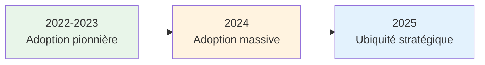

# Leçon 1.1 : Qu'est-ce que l'Intelligence Artificielle ?

## Objectifs pédagogiques

À la fin de cette leçon, vous serez capable de :
- **Situer** les grandes étapes de l'histoire de l'IA sur une chronologie
- **Distinguer** les concepts d'IA, ML, Réseaux de Neurones, Deep Learning et IA Générative
- **Évaluer** ce que l'IA peut et ne peut pas faire aujourd'hui

---

## 🎯 Accroche : Le phénomène qui a bouleversé le monde

En janvier 2023, une application a pulvérisé tous les records de l'histoire d'Internet : **ChatGPT** a atteint 100 millions d'utilisateurs en seulement 2 mois.

Pour mettre cela en perspective :
- **TikTok** : 9 mois pour atteindre 100 millions
- **Instagram** : 2 ans et demi
- **Facebook** : 4 ans et demi

> *Source : [UBS Research via TIME](https://time.com/6253615/chatgpt-fastest-growing/)*

**Question :** Qu'est-ce qui a rendu ChatGPT si révolutionnaire pour attirer autant d'utilisateurs aussi rapidement ?

*(Réponse attendue : C'est la première fois qu'une IA pouvait converser de manière naturelle, répondre à presque n'importe quelle question, et être accessible gratuitement au grand public.)*

Mais ChatGPT n'est pas apparu de nulle part. C'est l'aboutissement de **70 ans de recherche** en intelligence artificielle. Pour comprendre où nous en sommes, remontons le fil de cette histoire fascinante.

---

## 1.1 Histoire de l'IA : Une chronologie de rêves et de déceptions

### L'idée folle qui a tout lancé

Imaginez-vous en 1950. Les ordinateurs sont des machines gigantesques qui remplissent des pièces entières. Et pourtant, un mathématicien britannique nommé **Alan Turing** pose une question audacieuse dans son article "Computing Machinery and Intelligence" :

> *"Les machines peuvent-elles penser ?"*

**Question :** Comment pourrait-on tester si une machine "pense" vraiment ?

*(Réponse attendue : On pourrait la faire converser avec un humain et voir si l'humain peut distinguer la machine d'une vraie personne.)*

C'est exactement ce que Turing a proposé ! Le **Test de Turing** : si un humain, après une conversation textuelle, ne peut pas distinguer une machine d'un autre humain, alors cette machine peut être considérée comme "intelligente".

<details>
<summary>🤔 Question Socratique : Le Test de Turing est-il une bonne mesure de l'intelligence ?</summary>

### 🔑 Réponse

C'est un débat qui dure depuis 70 ans ! Le Test de Turing mesure la **simulation** de l'intelligence, pas l'intelligence elle-même.

Arguments **pour** :
- C'est un test pratique et mesurable
- Il se concentre sur le comportement observable

Arguments **contre** :
- Une machine pourrait "tricher" avec des astuces conversationnelles
- Comprendre et simuler sont deux choses différentes
- Un perroquet peut répéter des phrases sans les comprendre

Aujourd'hui, beaucoup considèrent que ChatGPT "passe" le Test de Turing... mais est-il vraiment intelligent ? Cette question reste ouverte.

</details>

---

### La chronologie complète de l'IA

Suivons les grandes étapes qui nous ont menés de Turing à ChatGPT :

```
┌─────────────────────────────────────────────────────────────────────────────┐
│                    CHRONOLOGIE DE L'INTELLIGENCE ARTIFICIELLE                │
├─────────────────────────────────────────────────────────────────────────────┤
│                                                                             │
│  1950 ──── Test de Turing                                                   │
│            "Les machines peuvent-elles penser ?"                            │
│                     │                                                       │
│  1956 ──── Conférence de Dartmouth ★ NAISSANCE DE L'IA                      │
│            Le terme "Intelligence Artificielle" est inventé                 │
│                     │                                                       │
│  1960s ─── Premiers programmes : ELIZA (chatbot), Perceptron                │
│            Optimisme énorme : "L'IA égalera l'humain dans 20 ans"           │
│                     │                                                       │
│  1974-1980 ─ PREMIER HIVER DE L'IA ❄️                                       │
│              Promesses non tenues → Financement coupé                       │
│                     │                                                       │
│  1980s ─── Systèmes experts (règles if/then)                                │
│            Succès commerciaux, mais limités                                 │
│                     │                                                       │
│  1987-1993 ─ DEUXIÈME HIVER DE L'IA ❄️                                      │
│              Systèmes experts trop rigides et coûteux                       │
│                     │                                                       │
│  1997 ──── Deep Blue bat Kasparov aux échecs ♟️                             │
│            Victoire symbolique (mais pas d'apprentissage, juste calcul)     │
│                     │                                                       │
│  2006 ──── Geoffrey Hinton relance les réseaux de neurones                  │
│            "Deep Learning" — entraînement de réseaux profonds               │
│                     │                                                       │
│  2012 ──── AlexNet révolutionne la vision par ordinateur 📸                 │
│            Deep Learning surpasse toutes les méthodes classiques            │
│                     │                                                       │
│  2016 ──── AlphaGo bat le champion mondial de Go 🎯                         │
│            Jeu considéré "impossible" pour une IA                           │
│                     │                                                       │
│  2017 ──── "Attention Is All You Need" — L'architecture Transformer         │
│            Révolution technique qui rendra possible GPT                     │
│                     │                                                       │
│  2018 ──── BERT (Google) et GPT-1 (OpenAI)                                  │
│            Premiers grands modèles de langage                               │
│                     │                                                       │
│  2020 ──── GPT-3 : 175 milliards de paramètres                              │
│            Capacités émergentes surprenantes                                │
│                     │                                                       │
│  2022 ──── ChatGPT : L'IA devient grand public 🚀                           │
│            100 millions d'utilisateurs en 2 mois                            │
│                     │                                                       │
│  2023+ ─── Course aux LLMs : GPT-4, Claude, Gemini, Mistral, LLaMA...       │
│            IA Générative : texte, images, vidéo, code                       │
│                                                                             │
└─────────────────────────────────────────────────────────────────────────────┘
```

Explorons maintenant chaque étape clé en détail.

---

### 🕰️ 1940 – Alan Turing et les bases de l'IA

Tout commence dans les années 1940 avec **Alan Turing**, un mathématicien britannique. C'est lui qui a posé la question fondatrice : *"Une machine peut-elle penser ?"*

Il imagine déjà un concept révolutionnaire : une machine capable d'exécuter n'importe quelle tâche logique, à condition qu'on lui donne les bonnes instructions. C'est à cette époque qu'on voit les premiers algorithmes, mais l'IA reste purement théorique.

> 💡 **Fun fact :** Turing a aussi contribué au décryptage d'Enigma pendant la Seconde Guerre mondiale — un exploit qui a raccourci la guerre de plusieurs années.

---

### 🎓 1956 – Naissance officielle du terme "Intelligence Artificielle"

En 1956, lors d'une conférence à **Dartmouth** aux États-Unis, un petit groupe de chercheurs fonde ce qu'on appelle officiellement "l'Intelligence Artificielle".

À ce moment-là, l'optimisme est immense : on pense que les machines vont bientôt égaler le cerveau humain. C'était un rêve un peu naïf, mais visionnaire. Les premiers programmes arrivent, capables de jouer aux échecs ou de résoudre de petits problèmes logiques.

---

### 🗣️ 1966-1970 – ELIZA et les premières tentatives de compréhension du langage

Dans les années 60-70, on assiste aux premières tentatives de création d'IA appliquée, notamment autour du **langage naturel**.

En 1966, **Joseph Weizenbaum**, chercheur au MIT, développe **ELIZA** — un programme capable de simuler une conversation avec un psychothérapeute.

ELIZA fonctionnait de manière assez simple : l'utilisateur tapait ses problèmes à l'écrit, et ELIZA reformulait son entrée ou piochait dans une banque de réponses préprogrammées pour relancer la discussion.

**Le but de Weizenbaum ?** Montrer les limites de la machine.

**Le résultat inattendu ?** Il a surtout mis en lumière celles des humains ! Nombreux sont ceux qui se sont attachés à leur psy artificiel, pensant même qu'ils conversaient avec un véritable être humain.

> Ce programme est aujourd'hui considéré comme **le premier chatbot de l'histoire**, et il a donné naissance à une branche entière de la recherche : le **Traitement Automatique du Langage Naturel (TALN)**.

---

### ❄️ Les "Hivers de l'IA" : Pourquoi l'IA a failli disparaître

Entre les années 1970 et 2000, l'IA a connu plusieurs périodes de déception appelées **« hivers de l'IA »**.

**Que s'est-il passé ?**

- Les promesses excessives des chercheurs n'ont pas été tenues
- Les financements se sont taris
- Le domaine a stagné pendant des années

**Question :** Pourquoi les chercheurs avaient-ils fait des promesses si ambitieuses ?

*(Réponse attendue : L'enthousiasme des premières réussites (programmes de jeu, ELIZA) leur a fait sous-estimer la complexité de l'intelligence humaine. Ils pensaient que quelques années suffiraient.)*

---

### 🧠 1990 – Apparition des réseaux neuronaux

Dans les années 90, on change de dimension. Les chercheurs s'inspirent du fonctionnement du cerveau humain : les neurones, les connexions, l'apprentissage par répétition.

C'est là qu'apparaissent les **réseaux neuronaux artificiels**, qu'on appelle aujourd'hui Deep Learning.

**Le problème ?** Les ordinateurs n'étaient pas encore assez puissants, et les données pas assez nombreuses. Les modèles restaient donc limités.

---

### ♟️ 1997 – Deep Blue bat Kasparov aux échecs

Et puis arrive un tournant symbolique : en 1997, l'ordinateur **Deep Blue** d'IBM bat **Garry Kasparov**, le champion du monde d'échecs.

Dans les années 1990, IBM travaille sur un supercalculateur spécialisé dans ce jeu. L'objectif ? Battre Kasparov, l'un des plus grands champions de tous les temps.

Après une première tentative ratée en 1996, Deep Blue prend sa revanche en 1997. C'est une première historique : jamais une machine n'avait battu un humain au plus haut niveau dans un jeu aussi complexe.

**Mais attention :** Deep Blue ne "pensait" pas — il calculait simplement toutes les combinaisons possibles beaucoup plus vite que l'humain. Une puissance de calcul phénoménale : **200 millions de coups analysés par seconde**.

> C'est un exploit de calcul, pas encore une vraie intelligence. Ce sera différent 20 ans plus tard, avec AlphaGo et ChatGPT, quand les machines apprendront *par elles-mêmes*.

---

### 📊 2006 – L'IA renaît grâce au Big Data et au Deep Learning

Après les désillusions des années 1990, un double événement va donner un coup de fouet décisif à l'IA.

**1. L'explosion des données (Big Data)**

Les volumes de données produits explosent grâce à :
- La démocratisation d'Internet
- La naissance des réseaux sociaux
- L'apparition de la 3G et des premiers smartphones
- Le projet Hadoop (open source) qui permet de stocker et traiter des montagnes de données

**2. Le retour du Deep Learning**

**Geoffrey Hinton**, un chercheur canadien longtemps marginalisé pour ses travaux sur les réseaux de neurones, revient sur le devant de la scène. Il relance le concept de **Deep Learning** — une technique qui imite les mécanismes d'apprentissage du cerveau humain.

Grâce aux immenses quantités de données et à la puissance des nouvelles cartes graphiques (GPU), on peut enfin mettre en œuvre ces techniques à grande échelle.

> C'est la base de tout ce qu'on connaît aujourd'hui : Google Translate, Siri, les correcteurs automatiques — ce sont déjà des IA basées sur le Deep Learning.

---

### 📸 2012 – AlexNet révolutionne la vision par ordinateur

Geoffrey Hinton a trouvé ses successeurs ! En 2012, ce sont ses doctorants qui vont faire basculer le monde de l'IA dans une nouvelle ère.

Chaque année, le challenge **ImageNet** met à l'épreuve des algorithmes chargés d'identifier des objets dans des millions de photos. Jusque-là, les meilleurs modèles plafonnaient.

Jusqu'à l'arrivée d'**AlexNet**, un réseau de neurones développé par **Alex Krizhevsky** et **Ilya Sutskever** sous la direction de Hinton.

**Le résultat ?** AlexNet ne se contente pas de gagner : il **pulvérise** les scores avec **10,8% d'erreurs en moins** que le deuxième. Un succès largement dû au Deep Learning et à l'utilisation de GPU.

À partir de là, tout s'accélère. Le Deep Learning s'invite partout : vision par ordinateur, traitement du langage, reconnaissance vocale, voitures autonomes, et même nos smartphones.

---

### 🎯 2016 – AlphaGo bat le champion mondial de Go

Pendant des années, le jeu de **Go** était considéré comme la dernière frontière. Avec plus de positions possibles qu'il y a d'atomes dans l'univers, aucune IA n'aurait dû pouvoir rivaliser avec les meilleurs joueurs humains.

Et pourtant… En 2016, **AlphaGo** (DeepMind/Google) affronte **Lee Sedol**, l'un des plus grands joueurs de Go de l'histoire.

**Le verdict ?** 4–1. Pour la machine.

Ce qui rend AlphaGo si redoutable, c'est sa **stratégie hybride** : des réseaux de neurones pour évaluer les positions, et un algorithme de parcours pour déterminer les meilleurs coups.

> Ce match a montré que l'IA pouvait briller dans des domaines qu'on pensait réservés à l'**intuition humaine**.

---

### 🔄 2017-2018 – Les Transformers et BERT révolutionnent le NLP

En 2017, l'article **"Attention Is All You Need"** introduit l'architecture **Transformer** — une révolution technique qui rendra possible GPT.

Les Transformers permettent à une IA de traiter des phrases entières **en parallèle**, et donc de comprendre le **contexte** d'un texte, pas juste les mots isolés.

En 2018, Google dévoile **BERT** (Bidirectional Encoder Representations from Transformers). Contrairement aux modèles précédents, BERT lit une phrase **dans les deux sens** : de gauche à droite, et de droite à gauche.

Pourquoi c'est important ? Pour comprendre le sens d'un mot, il faut tenir compte de ce qui l'entoure — avant ET après. Grâce à cette lecture bidirectionnelle, BERT peut analyser finement le contexte.

**Résultat ?** Des réponses plus précises, une compréhension plus naturelle, et une amélioration notable de Google Search.

---

### 🚀 2020 – GPT-3 inaugure l'ère des LLMs

En 2020, OpenAI dévoile **GPT-3** — un modèle qui propulse l'IA dans une toute nouvelle dimension.

Ce qui impressionne ? Sa taille : **175 milliards de paramètres**. Le plus grand modèle de langage jamais entraîné à l'époque.

GPT-3 peut rédiger un texte, résumer un article, traduire une phrase, le tout à partir d'un simple **prompt** (instruction en langage naturel).

Cette capacité donne naissance à une nouvelle compétence : le **Prompt Engineering** — l'art de parler à une IA pour obtenir ce que l'on veut.

> Pour la première fois, l'IA devient accessible au grand public. Plus besoin d'être chercheur ou codeur — il suffit de savoir formuler les bons prompts.

---

### 🌟 2022-2025 – L'ère des IA génératives

Avec la sortie de **ChatGPT** en novembre 2022, les géants de la tech se lancent dans une course effrénée. L'objectif : proposer l'assistant IA le plus complet possible.

**Les acteurs majeurs aujourd'hui :**

| Modèle | Entreprise | Spécialité |
|--------|------------|------------|
| **GPT-4, GPT-4o** | OpenAI | Le plus connu, génère texte, code, images |
| **Claude** | Anthropic | Fiabilité, compréhension de textes longs (200K tokens) |
| **Gemini** | Google | Multimodal, intégré à Google Workspace |
| **Mistral** | Mistral AI (France) | Open source, alternative européenne |
| **LLaMA** | Meta | Open source, base de nombreuses variations |
| **Copilot** | Microsoft | Intégré à Word, Excel, Outlook |
| **DALL-E, Midjourney** | OpenAI, Midjourney | Génération d'images |

Aujourd'hui, ces modèles ne se contentent plus de lire ou d'écrire : ils **voient**, **entendent**, **parlent** et même **raisonnent**. L'objectif ultime ? Développer une **AGI** (Artificial General Intelligence) — une IA capable d'égaler l'humain dans tous les domaines.

---

### 💥 Pourquoi le boom de l'IA maintenant ?

**Question :** L'IA existe depuis les années 50. Pourquoi explose-t-elle seulement maintenant ?

*(Réponse attendue : Parce que trois conditions n'avaient jamais été réunies avant.)*

Exactement ! Voici les **trois ingrédients** du boom actuel :

#### 🧾 1. Toujours plus de données

L'IA apprend à partir des données. Plus on lui en donne, plus elle devient performante.

- **90% des données mondiales** ont été créées au cours des deux dernières années
- Chaque photo Instagram, vidéo TikTok, email, facture génère des données exploitables
- ChatGPT a été entraîné sur des **milliards** de textes, images et lignes de code

#### ⚙️ 2. Toujours plus de puissance de calcul

Former une IA nécessite des milliers d'opérations par seconde.

- Il y a 15 ans, c'était réservé aux géants comme Google ou IBM
- Aujourd'hui, grâce au **cloud computing**, n'importe qui peut louer des serveurs puissants
- Le coût de calcul a été **divisé par 1000** en dix ans
- Les **GPU NVIDIA** ont rendu le deep learning à grande échelle possible

#### 🧠 3. Toujours plus d'innovations accessibles

- Nouveaux algorithmes (Transformers)
- Cloud et **APIs prêtes à l'emploi**
- Modèles accessibles **sans code** via des outils SaaS

**Exemples :**
- ChatGPT, Claude, Gemini → accessibles via navigateur
- Copilot dans Excel → automatisation pour tous
- Mistral AI → modèle open source français
- Notion AI, HubSpot AI → IA intégrée dans les outils du quotidien

---

> 💡 **Insight clé :** L'IA n'est pas nouvelle — elle mûrit depuis 80 ans. Ce qui est nouveau, c'est la **puissance de calcul**, le **volume de données**, et les **modèles accessibles à tous**. En 2025, une PME peut accéder aux mêmes outils que les grands groupes.

**Question :** En observant cette chronologie, pourquoi pensez-vous qu'il y a eu des "hivers" de l'IA ?

*(Réponse attendue : Les promesses étaient trop grandes par rapport aux capacités réelles. Quand les résultats n'arrivaient pas, les financements étaient coupés.)*

---

### 🌍 Le basculement historique : 2022-2025

L'IA est passée d'une technologie de laboratoire à un **pilier économique mondial** en seulement 3 ans.



**Chiffres clés révélateurs :**

| Indicateur | 2023 | 2024 | 2025 (projection) | Croissance |
|------------|------|------|-------------------|------------|
| Organisations utilisant l'IA | 55% | 78% | 87% | +58% en 2 ans |
| Investissements annuels | $189B | $252B | $320B | +69% en 2 ans |
| Productivité relative | 2.1x | 4.8x | 6.5x | Triplement |

*Sources : Stanford HAI, McKinsey, Gartner*

---

### 🌐 La géopolitique de l'IA

**Trois pôles mondiaux émergents :**

#### 1. États-Unis (Leadership technique et capitalistique)

- **75%** des modèles foundation de pointe
- **68%** des investissements privés mondiaux
- Silicon Valley + Boston comme épicentres

#### 2. Chine (Leadership d'adoption et de données)

- **580 millions** d'utilisateurs actifs d'applications IA
- **40%** des brevets IA mondiaux
- Stratégie gouvernementale "IA 2030"

#### 3. Europe (Leadership réglementaire et éthique)

- **AI Act** : première régulation complète mondiale
- Excellence en IA industrielle et médicale
- **22%** des publications scientifiques

<details>
<summary>🤔 Question Socratique : Pourquoi l'Europe mise-t-elle sur la régulation plutôt que sur la création de modèles ?</summary>

### 🔑 Réponse

Plusieurs facteurs expliquent cette position :

1. **Retard dans la course aux modèles** : Les Big Tech américaines (OpenAI, Google, Meta) et chinoises (Baidu, Alibaba) ont une avance considérable en termes de capitaux et de talents.

2. **Tradition réglementaire** : L'Europe a une culture de protection des droits individuels (RGPD = modèle mondial).

3. **Avantage stratégique** : En définissant les règles du jeu, l'Europe influence les standards mondiaux. Les entreprises qui veulent accéder au marché européen doivent se conformer.

4. **Exception française** : Mistral AI représente une tentative de souveraineté technologique européenne, avec un succès notable.

</details>

---

### Les leçons des hivers de l'IA

Les deux "hivers de l'IA" nous enseignent quelque chose de crucial :

| Période | Promesse | Réalité | Leçon |
|---------|----------|---------|-------|
| 1960s | "IA égalera l'humain en 20 ans" | Programmes très limités | L'IA symbolique (règles) ne suffit pas |
| 1980s | "Systèmes experts résoudront tout" | Trop rigides, pas de généralisation | Le savoir humain est difficile à capturer en règles |
| 2010s+ | Deep Learning | Succès massifs... avec beaucoup de données et de calcul | Les réseaux de neurones + données + GPU = la bonne recette |

<details>
<summary>🤔 Question Socratique : Sommes-nous dans une "bulle IA" aujourd'hui, ou cette fois c'est différent ?</summary>

### 🔑 Réponse

Arguments pour "c'est différent cette fois" :
- **Preuves concrètes** : ChatGPT, génération d'images, code assisté fonctionnent vraiment
- **Adoption massive** : Des millions d'utilisateurs quotidiens
- **Valeur économique** : Entreprises génèrent des revenus réels avec l'IA

Arguments pour "risque de bulle" :
- **Attentes démesurées** : Beaucoup pensent que l'AGI (IA générale) est imminente
- **Coûts énormes** : Entraîner GPT-4 a coûté ~100 millions de dollars
- **Limites visibles** : Hallucinations, pas de vrai raisonnement

La vérité ? Probablement entre les deux. L'IA d'aujourd'hui est **réelle et utile**, mais elle n'est pas "intelligente" au sens humain. La clé est de comprendre ce qu'elle peut et ne peut pas faire.

</details>

---

## 1.2 Le spectre complet : IA → ML → NN → DL → IA Générative

Maintenant que vous connaissez l'histoire, clarifions les termes. On entend souvent "IA", "Machine Learning", "Deep Learning"... Quelle est la différence ?

**Question :** Si quelqu'un vous dit "J'utilise de l'IA dans mon application", qu'est-ce que ça veut dire concrètement ?

*(Réponse attendue : Ça ne veut pas dire grand-chose ! "IA" est un terme très large qui peut désigner beaucoup de choses différentes, de simples règles à des réseaux de neurones complexes.)*

Exactement ! Explorons chaque niveau du spectre.

---

### Le schéma des cercles concentriques (version complète)

```
┌─────────────────────────────────────────────────────────────────────────────┐
│                                                                             │
│    ╔═══════════════════════════════════════════════════════════════════╗    │
│    ║                    INTELLIGENCE ARTIFICIELLE                      ║    │
│    ║   Tout système qui simule un comportement intelligent             ║    │
│    ║                                                                   ║    │
│    ║    ┌───────────────────────────────────────────────────────┐     ║    │
│    ║    │              MACHINE LEARNING (ML)                    │     ║    │
│    ║    │      Systèmes qui apprennent à partir de données      │     ║    │
│    ║    │                                                       │     ║    │
│    ║    │    ┌───────────────────────────────────────────┐     │     ║    │
│    ║    │    │        RÉSEAUX DE NEURONES (NN)           │     │     ║    │
│    ║    │    │   Architecture inspirée du cerveau        │     │     ║    │
│    ║    │    │                                           │     │     ║    │
│    ║    │    │    ┌───────────────────────────────┐     │     │     ║    │
│    ║    │    │    │      DEEP LEARNING (DL)       │     │     │     ║    │
│    ║    │    │    │   Réseaux avec BEAUCOUP de    │     │     │     ║    │
│    ║    │    │    │   couches (profonds)          │     │     │     ║    │
│    ║    │    │    │                               │     │     │     ║    │
│    ║    │    │    │    ┌───────────────────┐     │     │     │     ║    │
│    ║    │    │    │    │  IA GÉNÉRATIVE    │     │     │     ║    │
│    ║    │    │    │    │ Crée du nouveau   │     │     │     ║    │
│    ║    │    │    │    │ contenu (texte,   │     │     │     ║    │
│    ║    │    │    │    │ images, code...)  │     │     │     ║    │
│    ║    │    │    │    └───────────────────┘     │     │     │     ║    │
│    ║    │    │    │   Ex: GPT, DALL-E, Midjourney│     │     │     ║    │
│    ║    │    │    └───────────────────────────────┘     │     │     ║    │
│    ║    │    │   Ex: CNN (images), RNN (séquences)      │     │     ║    │
│    ║    │    └───────────────────────────────────────────┘     │     ║    │
│    ║    │   Ex: Régression, Arbres de décision, SVM           │     ║    │
│    ║    └───────────────────────────────────────────────────────┘     ║    │
│    ║   Ex: Systèmes experts, Règles métier, Recherche A*             ║    │
│    ╚═══════════════════════════════════════════════════════════════════╝    │
│                                                                             │
└─────────────────────────────────────────────────────────────────────────────┘
```

Chaque cercle intérieur est un **sous-ensemble** du cercle extérieur. Toute IA Générative utilise du Deep Learning, qui utilise des Réseaux de Neurones, qui est une forme de Machine Learning, qui est une branche de l'IA.

---

### Niveau 1 : Intelligence Artificielle (IA)

**Définition :** Elle est définie par Marvin Minsky comme étant « la science qui consiste à faire faire aux machines des choses qui nécessiteraient de l’intelligence si elles étaient réalisées par des hommes ».

C'est le terme le plus **large** et le plus **vague**. Il inclut :

| Type d'IA | Description | Exemple |
|-----------|-------------|---------|
| **Systèmes à règles** | Règles if/then codées par des humains | Thermostat intelligent, filtres anti-spam basiques |
| **Recherche & Optimisation** | Algorithmes qui explorent des solutions | GPS (plus court chemin), échecs (minimax) |
| **Systèmes experts** | Base de connaissances + moteur d'inférence | Diagnostic médical années 80 |
| **Machine Learning** | Apprentissage à partir de données | Voir niveau suivant |

**Question :** Un thermostat qui ajuste la température selon des règles programmées, est-ce de l'IA ?

*(Réponse attendue : Techniquement oui, c'est une forme très basique d'IA (système à règles). Mais on ne l'appellerait probablement pas "IA" aujourd'hui car le terme évoque quelque chose de plus sophistiqué.)*

**Ce qu'il faut retenir**
- L'IA **n'a pas besoin d'apprendre** pour exister 
- Peut être purement basée sur des règles logiques
- Objectif final : reproduire ou augmenter les capacités cognitives humaines
- Branches multiples : vision par ordinateur, traitement du langage, robotique, planification...
---

### Niveau 2 : Machine Learning (ML)

**Définition :** Sous-domaine de l'IA où les systèmes **apprennent** à partir de données plutôt que d'être explicitement programmés.

La différence fondamentale :

```
PROGRAMMATION CLASSIQUE :
┌─────────────┐     ┌───────────────┐     ┌──────────────┐
│   Données   │ ──► │   Programme   │ ──► │   Résultat   │
│             │     │ (écrit par    │     │              │
│             │     │  un humain)   │     │              │
└─────────────┘     └───────────────┘     └──────────────┘

MACHINE LEARNING :
┌─────────────┐     ┌───────────────┐     ┌──────────────┐
│   Données   │ ──► │  Algorithme   │ ──► │   Modèle     │
│      +      │     │     ML        │     │  (appris)    │
│  Résultats  │     │               │     │              │
│   attendus  │     └───────────────┘     └──────────────┘
                                                 │
                                                 ▼
                                          Peut prédire sur
                                          de nouvelles données
```

**Question :** Pourquoi le Machine Learning est-il devenu si populaire ces dernières années ?

*(Réponse attendue : Parce que certains problèmes sont trop complexes pour être programmés avec des règles (reconnaissance d'images, traduction...). Avec ML, on laisse la machine découvrir les patterns dans les données.)*

**Exemples d'algorithmes ML (sans réseaux de neurones) :**
- **Régression linéaire** : Prédire un nombre (prix d'une maison)
- **Arbres de décision** : Série de questions oui/non
- **Random Forest** : Moyenne de plusieurs arbres
- **SVM** : Trouver la meilleure frontière entre classes

Vous apprendrez ces algorithmes en détail au **Chapitre 3** !

---

### Niveau 3 : Réseaux de Neurones (Neural Networks)

**Définition :** Une architecture de ML inspirée (de manière simplifiée) du fonctionnement des neurones biologiques.

```
           NEURONE BIOLOGIQUE                    NEURONE ARTIFICIEL

    ──────────►│                           x₁ ────►┌─────┐
    Dendrites  │                           x₂ ────►│  Σ  │──► f(Σ) ──► sortie
    (entrées)  │    ╭──────╮               x₃ ────►│ w·x │
    ──────────►├────┤Corps ├────►Axone     ...     └─────┘
    ──────────►│    │      │    (sortie)     ↑        ↑
               │    ╰──────╯                 │        │
                                          poids    fonction
                                        (weights) d'activation
```

Un réseau de neurones = **beaucoup de neurones connectés en couches** :

```
    ENTRÉES           COUCHE CACHÉE          SORTIE

      ○ ─────────────────○
       ╲                ╱ ╲
        ╲              ╱   ╲
      ○ ──────────────○─────────○
        ╲            ╱ ╲   ╱
         ╲          ╱   ╲ ╱
      ○ ───────────○─────────○
                    ╲   ╱
                     ╲ ╱
                      ○
```

**Question :** Si un neurone artificiel n'est qu'une somme pondérée suivie d'une fonction, en quoi est-ce "intelligent" ?

*(Réponse attendue : Un seul neurone n'est pas intelligent. C'est la combinaison de millions de neurones, avec des poids ajustés par l'apprentissage, qui permet de capturer des patterns complexes.)*

<details>
<summary>🤔 Question Socratique : Pourquoi dit-on que les réseaux de neurones sont "inspirés" du cerveau mais pas identiques ?</summary>

### 🔑 Réponse

Les similitudes :
- Unités de calcul simples (neurones) connectées en réseau
- L'information passe d'une couche à l'autre
- L'apprentissage modifie la force des connexions

Les différences majeures :
- **Cerveau** : ~86 milliards de neurones, connexions en 3D, signaux électrochimiques continus
- **IA** : Quelques millions à milliards de "neurones", architecture en couches, nombres décimaux

Les réseaux de neurones sont une **métaphore mathématique**, pas une simulation du cerveau. Un neurone biologique est infiniment plus complexe qu'un neurone artificiel.

</details>

---

### Niveau 4 : Deep Learning (DL)

**Définition :** Machine Learning avec des réseaux de neurones **profonds** (beaucoup de couches cachées). Des architectures de réseaux de neurones artificiels comportant de multiples couches de traitement (d'où "deep"), permettant l'apprentissage de représentations hiérarchiques et abstraites à partir de données brutes.

Quelle est la différence avec un réseau de neurones "classique" ?

| Caractéristique | Réseau "shallow" | Réseau "deep" |
|-----------------|------------------|---------------|
| Nombre de couches cachées | 1-2 | Dizaines à centaines |
| Paramètres | Milliers | Millions à milliards |
| Capacité | Patterns simples | Abstractions hiérarchiques |
| Données nécessaires | Peu | Énormément |
| Puissance de calcul | CPU suffit | GPU/TPU indispensables |

**Pourquoi "profond" est-il si puissant ?**

Chaque couche apprend des **abstractions de plus en plus complexes** :

```
IMAGE D'UN CHAT
      │
      ▼
┌─────────────────────────────────────────────────────────────────┐
│ Couche 1 : Détecte les bords, contours, lignes                  │
│            ╱  │  ╲  ─  ═                                        │
└─────────────────────────────────────────────────────────────────┘
      │
      ▼
┌─────────────────────────────────────────────────────────────────┐
│ Couche 2-3 : Combine les bords en formes simples                │
│              ◯  △  □  ◇                                         │
└─────────────────────────────────────────────────────────────────┘
      │
      ▼
┌─────────────────────────────────────────────────────────────────┐
│ Couches 4-7 : Détecte des parties d'objets                      │
│               👁️  👂  👃  🐾                                     │
└─────────────────────────────────────────────────────────────────┘
      │
      ▼
┌─────────────────────────────────────────────────────────────────┐
│ Couches finales : Reconnaît l'objet complet                     │
│                   🐱 = CHAT !                                    │
└─────────────────────────────────────────────────────────────────┘
```

**Question :** Pourquoi le Deep Learning n'a-t-il explosé qu'après 2012 alors que les réseaux de neurones existaient depuis les années 1960 ?

*(Réponse attendue : Il fallait trois ingrédients qui n'étaient pas disponibles avant : 1) Beaucoup de données (Internet), 2) Puissance de calcul (GPU), 3) Algorithmes d'entraînement améliorés.)*

---

### Niveau 5 : IA Générative (GenAI)

**Définition :** Sous-ensemble du Deep Learning spécialisé dans la **création de nouveau contenu** (texte, images, audio, vidéo, code...).

C'est le cercle le plus récent et celui qui a propulsé l'IA dans le grand public.

| Type de contenu | Modèles | Exemples |
|-----------------|---------|----------|
| **Texte** | GPT, Claude, Gemini, LLaMA, Mistral | ChatGPT, Claude.ai |
| **Images** | Stable Diffusion, DALL-E, Midjourney | Génération d'art, photos |
| **Audio** | Whisper, ElevenLabs, Suno | Transcription, voix synthétique, musique |
| **Vidéo** | Sora, Runway, Pika | Clips vidéo générés |
| **Code** | Codex, Claude, Copilot | GitHub Copilot |
| **3D** | Point-E, DreamFusion | Objets 3D à partir de texte |

**Question :** Quelle est la différence fondamentale entre un modèle de classification (ex: "est-ce un chat ou un chien ?") et un modèle génératif (ex: "dessine-moi un chat") ?

*(Réponse attendue : Un modèle de classification choisit parmi des catégories existantes, reconnait des patterns. Un modèle génératif crée quelque chose de nouveau qui n'existait pas avant.)*

<details>
<summary>🤔 Question Socratique : Comment une IA peut-elle "créer" quelque chose de nouveau si elle ne fait que des mathématiques ?</summary>

### 🔑 Réponse

C'est une question philosophique profonde ! Voici comment ça fonctionne techniquement :

1. **Pendant l'entraînement** : Le modèle analyse des millions d'exemples (textes, images) et apprend les **patterns statistiques** — quels mots suivent quels mots, quels pixels accompagnent quels pixels.

2. **Pendant la génération** : Le modèle **échantillonne** parmi les possibilités probables, avec un peu d'aléatoire contrôlé.

Ce n'est pas de la "créativité" au sens humain — c'est de la **recombinaison sophistiquée de patterns appris**.

Est-ce vraiment différent de la créativité humaine ? Les artistes humains sont aussi influencés par tout ce qu'ils ont vu et appris... Le débat reste ouvert !

</details>

---

### Niveau 6 : 🤖 IA Agentique : La prochaine frontière**

**Définition**
> Systèmes d'IA autonomes capables de **planifier et exécuter des tâches complexes** en interagissant avec leur environnement.

**Capacités des agents IA**
1. **Planification** : Décomposer un objectif en étapes
2. **Outillage** : Utiliser des outils externes (API, calculatrice)
3. **Mémoire** : Se souvenir des interactions passées
4. **Auto-amélioration** : Apprendre de ses erreurs

**Exemples d'agents**
- Assistant personnel autonome (planifier vos vacances)
- Agent de trading algorithmique
- Robot domestique intelligent
- Assistant de recherche scientifique

---

### Tableau récapitulatif du spectre

| | IA | ML | NN | DL | GenAI |
|--|----|----|----|----|-------|
| **Définition** | Systèmes "intelligents" | Apprendre de données | Algorithmes inspirés du cerveau | NN avec plusieurs couches | Créer du contenu |
| **Relations** | Domaine parent | Sous-domaine de l'IA | Type d'algorithme ML | Type spécifique de NN | Application du DL |
| **Données** | Optionnelles | Requises | Requises | Beaucoup requises | Énormément requises |
| **Calcul** | Variable | Modéré | Élevé | Très élevé | Extrêmement élevé |
| **Exemple simple** | Thermostat intelligent | Filtre anti-spam | Reconnaissance de chiffres | Reconnaissance faciale | ChatGPT |
| **Force principale** | Logique/raisonnement | Patterns statistiques | Modèles non-linéaires | Représentations complexes | Créativité/innovation |

---

### **💡 Points clés à retenir**

1. **Hiérarchie inclusive** : GenAI ⊂ DL ⊂ NN ⊂ ML ⊂ IA
2. **Plus on descend, plus c'est spécialisé** (et souvent puissant)
3. **Le "meilleur" outil dépend du problème**, pas de la technologie
4. **L'IA ne remplace pas l'intelligence humaine** : Elle l'augmente
5. **L'évolution est rapide** : Ce qui est vrai aujourd'hui peut changer demain

---

### **Métaphore finale**

Pensez à la construction d'une maison :

- **IA** = L'idée de "maison"
- **ML** = Les techniques de construction modernes
- **NN** = L'utilisation de briques et ciment
- **DL** = Les gratte-ciels (beaucoup de couches)
- **GenAI** = La capacité de concevoir de nouveaux styles architecturaux
- **IA Agentique** = Un robot qui peut construire la maison de A à Z

Chaque niveau **inclut** et **s'appuie** sur les précédents, tout en ajoutant de nouvelles capacités.

---

<details>
<summary>🤔 Question Socratique : Un GPS qui calcule le meilleur itinéraire utilise-t-il du Machine Learning ?</summary>

### 🔑 Réponse

**Pas nécessairement.** Un GPS classique utilise des algorithmes déterministes (comme Dijkstra ou A*) pour trouver le chemin le plus court. C'est de l'IA « classique » basée sur des règles.

**En revanche**, Google Maps ou Waze utilisent du Machine Learning pour :
- Prédire le trafic en temps réel
- Estimer les temps de trajet basés sur les données historiques
- Apprendre les préférences de l'utilisateur

C'est un bon exemple de la différence entre **IA basée sur des règles** et **IA basée sur l'apprentissage**.

</details>

---

## 1.3 L'état actuel de l'IA : Ce qui marche, ce qui ne marche pas

Maintenant que vous comprenez le spectre, posons-nous la question cruciale : **où en est l'IA en 2024-2025 ?**

### Ce que l'IA sait (très bien) faire aujourd'hui

| Domaine | Capacité | Niveau |
|---------|----------|--------|
| **Reconnaissance d'images** | Identifier objets, visages, scènes | Surpasse l'humain dans certains cas |
| **Transcription audio** | Convertir parole en texte | Quasi parfait |
| **Traduction** | Traduire entre langues | Excellent (pas parfait pour les nuances) |
| **Génération de texte** | Écrire, résumer, reformuler | Très impressionnant |
| **Génération d'images** | Créer des images à partir de descriptions | Photoréaliste possible |
| **Recommandations** | Suggérer contenu, produits | Omniprésent et efficace |
| **Jouer à des jeux** | Échecs, Go, jeux vidéo | Surpasse les meilleurs humains |
| **Assistance au code** | Compléter, expliquer, débuguer | Très utile (pas parfait) |

### Ce que l'IA ne sait PAS (encore) faire

| Limitation | Explication |
|------------|-------------|
| **Raisonner vraiment** | Les LLMs simulent le raisonnement mais font des erreurs logiques basiques |
| **Comprendre le sens** | Ils manipulent des patterns statistiques, pas des concepts |
| **Accéder au monde réel** | Pas de perception directe, dépend des données d'entraînement |
| **Avoir une mémoire à long terme** | Chaque conversation repart de zéro (sans outils externes) |
| **Être fiable à 100%** | Les "hallucinations" sont inhérentes au fonctionnement |
| **Généraliser hors distribution** | Mauvais sur des situations très différentes de l'entraînement |
| **Avoir du bon sens** | Les connaissances de base qu'un enfant possède |

**Question :** Un LLM comme ChatGPT peut résoudre des problèmes de maths complexes. Cela prouve-t-il qu'il "comprend" les mathématiques ?

*(Réponse attendue : Pas nécessairement. Il a vu des millions d'exemples de résolution de problèmes et reproduit les patterns. Il peut échouer sur des problèmes simples formulés différemment.)*

---

### Démystification : "L'IA n'est pas magique"

Voici la phrase clé à retenir de ce module :

> **L'IA n'est pas magique — c'est de la reconnaissance de patterns à très grande échelle.**

```
┌─────────────────────────────────────────────────────────────────────────┐
│                                                                         │
│   CE QUE L'IA FAIT VRAIMENT :                                          │
│                                                                         │
│   ┌───────────────┐      ┌──────────────────┐      ┌────────────────┐  │
│   │ DONNÉES       │      │   TROUVER DES    │      │  APPLIQUER     │  │
│   │ (beaucoup!)   │ ───► │   PATTERNS       │ ───► │  CES PATTERNS  │  │
│   │               │      │   STATISTIQUES   │      │                │  │
│   └───────────────┘      └──────────────────┘      └────────────────┘  │
│                                                                         │
│   CE QUE L'IA NE FAIT PAS :                                            │
│                                                                         │
│   ✗ Comprendre comme un humain                                         │
│   ✗ Avoir des intentions ou des désirs                                 │
│   ✗ Posséder une conscience                                            │
│   ✗ Apprendre en continu sans réentraînement                           │
│                                                                         │
└─────────────────────────────────────────────────────────────────────────┘
```

<details>
<summary>🤔 Question Socratique : Si l'IA ne fait que trouver des patterns, comment peut-elle sembler si "intelligente" ?</summary>

### 🔑 Réponse

Deux raisons principales :

1. **L'échelle change la donne**
   - GPT-4 a été entraîné sur des centaines de milliards de mots
   - Il a "vu" tellement de patterns qu'il peut combiner des connaissances de manière surprenante
   - C'est comme avoir lu toute la bibliothèque de l'humanité

2. **Notre bar est plus bas qu'on ne le pense**
   - Beaucoup de tâches "intelligentes" sont en fait des patterns
   - Répondre à un email = pattern
   - Résumer un texte = pattern
   - Même écrire de la poésie suit des patterns stylistiques

Ce qui est troublant : nous ne savons pas exactement où s'arrête la "simple" reconnaissance de patterns et où commence la "vraie" intelligence. C'est peut-être la même chose à des échelles différentes ?

</details>

---

## Résumé de la leçon

### Ce que vous avez appris

1. **Histoire de l'IA** : De Turing (1950) à ChatGPT (2022), avec les hivers et les percées
2. **Le spectre IA** : IA → ML → NN → DL → GenAI (cercles concentriques)
3. **L'état actuel** : Capacités impressionnantes mais limites réelles (pas de compréhension, hallucinations)

### Points clés à retenir

- L'IA n'est pas nouvelle — 70 ans d'histoire
- "Machine Learning" = apprendre des données (pas de règles programmées)
- "Deep Learning" = réseaux de neurones avec beaucoup de couches
- "IA Générative" = créer du nouveau contenu
- **L'IA est puissante mais pas magique — c'est de la reconnaissance de patterns**

---

## Réflexion métacognitive

Avant de passer à la suite, prenez un moment pour réfléchir :

1. **Qu'est-ce qui vous a le plus surpris dans cette leçon ?**

2. **Quelle partie avez-vous trouvée la plus difficile à comprendre ?**

3. **Comment expliquerez-vous la différence entre ML et Deep Learning à quelqu'un qui ne connaît rien à l'IA ?**

---

## Pour aller plus loin (optionnel)

- 📺 [3Blue1Brown — But what is a neural network?](https://www.youtube.com/watch?v=aircAruvnKk) — Excellente visualisation
- 📄 [Attention Is All You Need (2017)](https://arxiv.org/abs/1706.03762) — L'article fondateur des Transformers
- 🎮 [TensorFlow Playground](https://playground.tensorflow.org/) — Expérimentez avec des réseaux de neurones
