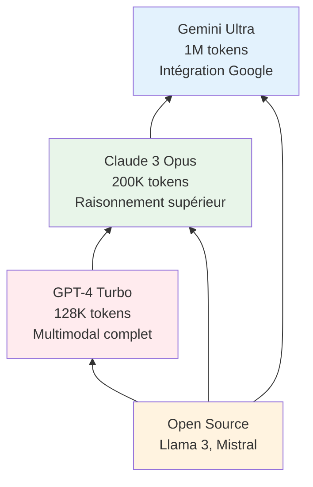

# Leçon 1.3 : Le Paysage de l'IA

## Objectifs pédagogiques

À la fin de cette leçon, vous serez capable de :

- **Cartographier** les différents niveaux d'acteurs dans l'écosystème IA (Big Tech, Enterprise, PME)
- **Identifier** les principaux fournisseurs de modèles et leurs spécificités
- **Naviguer** dans l'écosystème technique (frameworks, librairies, cloud)

---

## 🎯 Accroche : La startup qui vaut plus que des pays entiers

En janvier 2023, OpenAI n'était qu'une startup de recherche relativement confidentielle. Deux ans plus tard, en octobre 2025, sa valorisation a atteint **500 milliards de dollars** — plus que le PIB de la Belgique ou de l'Argentine.

Quelques chiffres vertigineux :

- **Microsoft** a investi ~14 milliards de dollars dans OpenAI
- **Valorisation 2024** : 157 milliards de dollars
- **Valorisation 2025** : 500 milliards de dollars (x3 en un an !)
- **Revenus 2025 estimés** : 12.7 milliards de dollars
- **Pertes 2024** : 5 milliards de dollars (oui, ils perdent de l'argent)

> *Source : [CNBC — OpenAI Funding Round](https://www.cnbc.com/2024/10/02/openai-raises-at-157-billion-valuation-microsoft-nvidia-join-round.html)*

**Question :** Comment une entreprise peut-elle valoir 500 milliards tout en perdant 5 milliards par an ?

*(Réponse attendue : Les investisseurs parient sur le potentiel futur. Ils croient que l'IA transformera toutes les industries et qu'OpenAI sera un acteur dominant. C'est un pari sur l'avenir, pas sur la rentabilité actuelle.)*

Cette course aux milliards révèle une bataille mondiale pour dominer l'IA. Mais qui sont les joueurs ? Et où vous situez-vous dans cet écosystème ?

---

## 3.1 La Pyramide de l'IA : Qui fait quoi ?

### L'idée clé : tout le monde n'a pas les mêmes ressources

Entraîner GPT-4 a coûté environ **100 millions de dollars** et nécessité des milliers de GPU pendant des mois. C'est hors de portée de 99.99% des entreprises.

Mais cela ne signifie pas que seules les géants peuvent utiliser l'IA. Il existe différents niveaux d'intervention :

```
┌─────────────────────────────────────────────────────────────────────────────┐
│                       LA PYRAMIDE DE L'IA                                   │
├─────────────────────────────────────────────────────────────────────────────┤
│                                                                             │
│                              /\                                             │
│                             /  \                                            │
│                            /    \                                           │
│                           / BIG  \        🔴 NIVEAU 3 : CRÉATEURS          │
│                          / TECH   \       Entraînent des modèles from      │
│                         /  (5-10)  \      scratch. Budget : 100M$+         │
│                        /────────────\     Ex: OpenAI, Google, Meta         │
│                       /              \                                      │
│                      /   ENTERPRISE   \   🟠 NIVEAU 2 : ADAPTATEURS         │
│                     /   (centaines)    \  Fine-tuning, RAG, déploiement    │
│                    /                    \ Budget : 100K$ - 10M$            │
│                   /──────────────────────\Ex: Banques, Assurances          │
│                  /                        \                                 │
│                 /    STARTUPS & PME        \  🟢 NIVEAU 1 : UTILISATEURS   │
│                /      (millions)            \ APIs, no-code, solutions     │
│               /                              \prêtes. Budget : 0 - 100K$   │
│              /────────────────────────────────\Ex: Vous !                  │
│             /                                  \                            │
│            ▔▔▔▔▔▔▔▔▔▔▔▔▔▔▔▔▔▔▔▔▔▔▔▔▔▔▔▔▔▔▔▔▔▔▔▔                           │
│                                                                             │
└─────────────────────────────────────────────────────────────────────────────┘
```

### Niveau 3 : Les Créateurs (Big Tech)

**Qui ?** OpenAI, Google DeepMind, Meta AI, Anthropic, Mistral, xAI

**Ce qu'ils font :**

- Entraînent des modèles de fondation (foundation models) from scratch
- Investissent des centaines de millions en compute
- Emploient les meilleurs chercheurs mondiaux
- Définissent l'état de l'art

**Ressources nécessaires :**

- Budget : 100M$+ par modèle
- Équipes : 100+ chercheurs et ingénieurs
- Infrastructure : milliers de GPU/TPU pendant des mois
- Données : milliards de documents

**Question :** Pourquoi si peu d'entreprises peuvent créer des modèles from scratch ?

*(Réponse attendue : Le coût est prohibitif — en argent, en expertise, en données, et en infrastructure. Il faut réunir tous ces éléments à très grande échelle.)*

---

### Niveau 2 : Les Adaptateurs (Enterprise)

**Qui ?** Grandes entreprises (banques, assurances, santé, retail), cabinets de conseil, éditeurs logiciels

**Ce qu'ils font :**

- **Fine-tuning** : Adapter un modèle existant à leur domaine
- **RAG** : Connecter un LLM à leurs données propriétaires
- **Déploiement** : Créer des applications internes ou pour clients
- **Intégration** : Incorporer l'IA dans leurs produits existants

**Ressources nécessaires :**

- Budget : 100K$ - 10M$ par projet
- Équipes : 5-50 data scientists/ML engineers
- Infrastructure : Cloud (AWS, GCP, Azure)
- Données : Données métier propriétaires

**Exemple concret :** Une banque qui :

1. Utilise GPT-4 comme base
2. Le fine-tune sur des milliers de contrats bancaires
3. Construit un RAG avec sa documentation interne
4. Déploie un assistant pour les conseillers

<details>
<summary>🤔 Question Socratique : Pourquoi une banque ne se contente-t-elle pas d'utiliser ChatGPT directement ?</summary>

### 🔑 Réponse

Plusieurs raisons :

1. **Confidentialité** : Les données clients ne peuvent pas être envoyées à un service externe.

2. **Spécialisation** : ChatGPT ne connaît pas les produits spécifiques de la banque, ses procédures internes, sa réglementation locale.

3. **Contrôle** : La banque veut maîtriser les réponses, éviter les hallucinations sur des sujets financiers sensibles.

4. **Conformité** : Les régulateurs exigent de savoir comment les décisions sont prises (auditabilité).

5. **Coût à l'échelle** : Pour des millions de requêtes par jour, il peut être plus économique d'héberger son propre modèle.

C'est pourquoi le niveau 2 existe : prendre les modèles de base et les adapter au contexte métier.

</details>

---

### Niveau 1 : Les Utilisateurs (Startups, PME, Individus)

**Qui ?** Startups, PME, développeurs indépendants, créateurs de contenu, étudiants (vous !)

**Ce qu'ils font :**

- **APIs** : Appellent des modèles via des APIs (OpenAI, Claude, Mistral)
- **No-code** : Utilisent des outils comme Zapier, Make, GPTs
- **Solutions prêtes** : Intègrent des SaaS qui embarquent de l'IA
- **Prompts** : Maîtrisent le prompt engineering

**Ressources nécessaires :**

- Budget : 0$ - 100K$ par an
- Équipes : 1-10 personnes
- Infrastructure : Aucune (tout en cloud)
- Données : Contexte fourni dans les prompts ou RAG léger

**Exemple concret :** Une startup qui :

1. Utilise l'API Claude pour générer des résumés
2. Intègre Pinecone pour la recherche sémantique
3. Déploie sur Vercel en quelques heures
4. Paie au token utilisé

---

### Où vous situez-vous ?

Après ce bootcamp, vous serez équipés pour opérer aux **niveaux 1 et 2** :

| Compétence | Niveau 1 | Niveau 2 |
|------------|----------|----------|
| APIs LLM | ✅ | ✅ |
| Prompt engineering | ✅ | ✅ |
| RAG | ✅ | ✅ |
| Fine-tuning | — | ✅ (conceptuel) |
| Déploiement | ✅ (simple) | ✅ (production) |
| ML classique | ✅ | ✅ |

---

## 3.2 Les Acteurs Majeurs

### La carte des fournisseurs de LLMs

```
┌─────────────────────────────────────────────────────────────────────────────┐
│                    PRINCIPAUX FOURNISSEURS DE LLMs (2025)                   │
├─────────────────────────────────────────────────────────────────────────────┤
│                                                                             │
│  ┌─────────────────────────────────────────────────────────────────────┐   │
│  │                      MODÈLES PROPRIÉTAIRES                          │   │
│  │                    (closed-source, via API)                         │   │
│  ├─────────────────────────────────────────────────────────────────────┤   │
│  │                                                                     │   │
│  │  🟢 OpenAI          🟣 Anthropic        🔵 Google                   │   │
│  │  GPT-4, GPT-4o      Claude 3.5 Sonnet   Gemini Pro/Ultra           │   │
│  │  o1, o1-mini        Claude 3 Opus       Gemini Flash               │   │
│  │                                                                     │   │
│  │  Forces:            Forces:             Forces:                     │   │
│  │  - Écosystème       - Sécurité/Safety   - Multimodal               │   │
│  │  - Plugins/GPTs     - Contexte 200K     - Intégration Google       │   │
│  │  - DALL-E, Whisper  - Coding excellent  - Pricing compétitif       │   │
│  │                                                                     │   │
│  └─────────────────────────────────────────────────────────────────────┘   │
│                                                                             │
│  ┌─────────────────────────────────────────────────────────────────────┐   │
│  │                      MODÈLES OPEN-SOURCE                            │   │
│  │                  (téléchargeables, self-host possible)              │   │
│  ├─────────────────────────────────────────────────────────────────────┤   │
│  │                                                                     │   │
│  │  🟠 Meta AI          🔴 Mistral           ⚪ Autres                  │   │
│  │  LLaMA 3, 3.1        Mistral Large        Falcon (TII)             │   │
│  │  LLaMA 3.2           Mixtral 8x22B        Qwen (Alibaba)           │   │
│  │  Code Llama          Mistral Small        Yi (01.AI)               │   │
│  │                                                                     │   │
│  │  Forces:             Forces:              Forces:                   │   │
│  │  - Gratuit           - Basé en Europe     - Spécialisations        │   │
│  │  - Communauté        - Rapport qualité/   - Multilingue            │   │
│  │  - Fine-tunable        prix excellent     - Domaines spécifiques   │   │
│  │                                                                     │   │
│  └─────────────────────────────────────────────────────────────────────┘   │
│                                                                             │
└─────────────────────────────────────────────────────────────────────────────┘
```

### Les profils détaillés

#### OpenAI 🟢

**Modèles phares :** GPT-4, GPT-4o, o1, o1-mini

| Caractéristique | Détail |
|-----------------|--------|
| **Fondation** | 2015 (nonprofit), restructuré en 2019 |
| **Investisseur principal** | Microsoft (~14B$) |
| **Revenus 2025** | ~12.7B$ (estimé) |
| **Forces** | Écosystème le plus mature, ChatGPT, DALL-E, Whisper |
| **Faiblesses** | Prix élevé, boîte noire totale |

**Produits notables :**

- **ChatGPT** : L'application grand public
- **GPT-4 API** : Pour les développeurs
- **GPTs** : Agents personnalisés no-code
- **DALL-E** : Génération d'images
- **Whisper** : Transcription audio

---

#### Anthropic 🟣

**Modèles phares :** Claude 3.5 Sonnet, Claude 3 Opus, Claude 3 Haiku

| Caractéristique | Détail |
|-----------------|--------|
| **Fondation** | 2021 (par d'anciens employés d'OpenAI) |
| **Investisseurs** | Google, Amazon, Spark Capital |
| **Focus** | AI Safety — IA alignée et sûre |
| **Forces** | Contexte très long (200K tokens), coding excellent |
| **Faiblesses** | Moins de fonctionnalités annexes |

**Particularités :**

- **Constitutional AI** : Méthode d'entraînement basée sur des principes éthiques
- **Contexte 200K** : Peut analyser des livres entiers en une seule requête
- **Claude Code** : Agent de programmation autonome

**Question :** Pourquoi une entreprise fondée par des ex-OpenAI met-elle autant l'accent sur la "sécurité" de l'IA ?

*(Réponse attendue : Les fondateurs étaient inquiets de la direction prise par OpenAI vers la commercialisation rapide. Ils veulent développer l'IA de manière plus prudente et contrôlée.)*

---

#### Google DeepMind 🔵

**Modèles phares :** Gemini Pro, Gemini Ultra, Gemini Flash

| Caractéristique | Détail |
|-----------------|--------|
| **Fondation** | DeepMind 2010, fusionné avec Google Brain 2023 |
| **Ressources** | Quasi illimitées (Google) |
| **Forces** | Multimodal natif, intégration Google |
| **Faiblesses** | Déploiement plus lent que les concurrents |

**Produits notables :**

- **Gemini** : Modèle multimodal (texte, image, audio, vidéo)
- **Bard/Gemini Chat** : Concurrent de ChatGPT
- **Vertex AI** : Plateforme MLOps de Google Cloud

---

#### Meta AI 🟠

**Modèles phares :** LLaMA 3, LLaMA 3.1, LLaMA 3.2, Code Llama

| Caractéristique | Détail |
|-----------------|--------|
| **Stratégie** | Open-source les modèles (avec restrictions) |
| **Motivation** | Contrer les monopoles, bénéficier de la communauté |
| **Forces** | Gratuit, fine-tunable, communauté énorme |
| **Faiblesses** | Pas d'API directe (via partenaires) |

**Impact :** LLaMA a démocratisé l'accès aux LLMs performants. Des milliers de variations existent sur Hugging Face.

<details>
<summary>🤔 Question Socratique : Pourquoi Meta donne-t-il gratuitement des modèles qui ont coûté des millions à développer ?</summary>

### 🔑 Réponse

Plusieurs raisons stratégiques :

1. **Éviter les monopoles** : Si OpenAI et Google dominent l'IA, Meta devient dépendant. En open-sourcant, Meta crée un écosystème alternatif.

2. **Amélioration gratuite** : La communauté trouve des bugs, propose des améliorations, crée des outils. Meta bénéficie de ces contributions.

3. **Adoption** : Plus de développeurs utilisent LLaMA, plus l'écosystème Meta devient central.

4. **Recrutement** : Les meilleurs chercheurs veulent travailler sur des projets open-source à impact.

5. **Pas leur business model** : Meta gagne de l'argent avec la publicité, pas avec les API. Ils n'ont pas besoin de monétiser les modèles.

C'est un choix stratégique, pas philanthropique.

</details>

---

#### Mistral 🔴

**Modèles phares :** Mistral Large, Mixtral 8x22B, Mistral Small

| Caractéristique | Détail |
|-----------------|--------|
| **Fondation** | 2023 (Paris, France) |
| **Fondateurs** | Ex-Google DeepMind et Meta |
| **Valorisation** | ~6B$ (2024) |
| **Forces** | Rapport qualité/prix, souveraineté européenne |
| **Faiblesses** | Écosystème moins mature |

**Pourquoi c'est important :**

- **Souveraineté** : Alternative européenne aux géants américains
- **Efficacité** : Mixtral rivalise avec GPT-3.5 pour une fraction du coût
- **Open-source** : Modèles de base disponibles

---

### Propriétaire vs Open-Source : Le tableau comparatif

| Aspect | Propriétaire (OpenAI, Claude) | Open-Source (LLaMA, Mistral) |
|--------|-------------------------------|------------------------------|
| **Coût** | Pay-per-token (peut être cher à l'échelle) | Gratuit (mais infra à payer si self-hosted) |
| **Qualité** | Généralement supérieure | Rattrape rapidement |
| **Confidentialité** | Données envoyées au fournisseur | 100% contrôle si self-hosted |
| **Personnalisation** | Fine-tuning limité | Fine-tuning complet possible |
| **Déploiement** | Immédiat (API) | Plus complexe (infrastructure) |
| **Support** | Professionnel | Communauté |
| **Mise à jour** | Automatique | Manuelle |

---

## 3.3 Le Paysage Technologique 2024-2025

### Les modèles dominants (Le "Big Three")



### Caractéristiques des modèles 2025

Les LLMs de 2025 partagent plusieurs caractéristiques clés :

1. **Multimodalité native** : Texte, image, audio, vidéo dans un seul modèle
2. **Contextes étendus** : Jusqu'à 1 million de tokens (≈ 750 pages)
3. **Spécialisation verticale** : Modèles spécifiques médecine, droit, finance
4. **Efficacité énergétique** : -60% consommation vs. 2022

---

### L'émergence des "Small Language Models" (SLMs)

**La contre-révolution** : Des modèles plus petits mais plus efficaces

| Modèle | Taille | Performance | Cas d'usage |
|--------|--------|-------------|-------------|
| **Phi-3** (Microsoft) | 3,8B paramètres | 90% de GPT-4 | Edge devices, mobiles |
| **Gemma** (Google) | 2B paramètres | Rapidité ×3 | Applications temps réel |
| **Mistral 8x7B** | 7B paramètres | Économie d'énergie | Entreprises, vie privée |

**Avantages des SLMs :**

- **Coût d'entraînement** : 1/1000ème des LLMs
- **Exécution locale** possible (sur votre machine)
- **Respect vie privée** : données ne quittent pas l'appareil
- **Latence réduite** : réponses quasi-instantanées

<details>
<summary>🤔 Question Socratique : Pourquoi les "petits" modèles deviennent-ils si populaires alors que "plus gros = meilleur" ?</summary>

### 🔑 Réponse

C'est un changement de paradigme intéressant :

1. **Loi des rendements décroissants** : Au-delà d'une certaine taille, les gains de performance diminuent fortement par rapport aux coûts.

2. **Distillation des connaissances** : On peut "transférer" le savoir d'un grand modèle vers un petit (technique de distillation).

3. **Cas d'usage réels** : La plupart des applications n'ont pas besoin de GPT-4 — un modèle plus petit suffit pour des tâches spécifiques.

4. **Contraintes pratiques** : Coût, latence, vie privée, empreinte carbone — tout pousse vers l'efficacité.

**Analogie** : C'est comme les voitures — une F1 est impressionnante, mais pour aller au travail, une Clio suffit (et coûte moins cher en essence).

</details>

---

## 3.4 L'Écosystème Technique

### Les couches de l'écosystème

Pour construire une application IA, vous aurez besoin de briques à différents niveaux :

```
┌─────────────────────────────────────────────────────────────────────────────┐
│                    L'ÉCOSYSTÈME TECHNIQUE DE L'IA                           │
├─────────────────────────────────────────────────────────────────────────────┤
│                                                                             │
│  NIVEAU 4 : APPLICATIONS                                                    │
│  ┌─────────────────────────────────────────────────────────────────────┐   │
│  │  ChatGPT │ Claude.ai │ Copilot │ Midjourney │ Notion AI │ ...       │   │
│  └─────────────────────────────────────────────────────────────────────┘   │
│                                    ▲                                        │
│                                    │                                        │
│  NIVEAU 3 : FRAMEWORKS D'ORCHESTRATION                                      │
│  ┌─────────────────────────────────────────────────────────────────────┐   │
│  │  LangChain │ LlamaIndex │ Haystack │ Semantic Kernel │ AutoGen      │   │
│  └─────────────────────────────────────────────────────────────────────┘   │
│                                    ▲                                        │
│                                    │                                        │
│  NIVEAU 2 : APIS & LIBRAIRIES ML                                            │
│  ┌─────────────────────────────────────────────────────────────────────┐   │
│  │  OpenAI SDK │ Anthropic SDK │ HuggingFace │ scikit-learn │ ...      │   │
│  └─────────────────────────────────────────────────────────────────────┘   │
│                                    ▲                                        │
│                                    │                                        │
│  NIVEAU 1 : FRAMEWORKS DEEP LEARNING                                        │
│  ┌─────────────────────────────────────────────────────────────────────┐   │
│  │  PyTorch │ TensorFlow │ JAX │ Keras                                 │   │
│  └─────────────────────────────────────────────────────────────────────┘   │
│                                    ▲                                        │
│                                    │                                        │
│  NIVEAU 0 : INFRASTRUCTURE                                                  │
│  ┌─────────────────────────────────────────────────────────────────────┐   │
│  │  AWS │ GCP │ Azure │ NVIDIA GPUs │ TPUs                             │   │
│  └─────────────────────────────────────────────────────────────────────┘   │
│                                                                             │
└─────────────────────────────────────────────────────────────────────────────┘
```

### Ce que vous utiliserez dans ce bootcamp

#### Niveau 2 : APIs et Librairies

**scikit-learn** — Machine Learning classique

```python
# Exemple : Classification avec Random Forest
from sklearn.ensemble import RandomForestClassifier
from sklearn.model_selection import train_test_split

model = RandomForestClassifier(n_estimators=100)
model.fit(X_train, y_train)
predictions = model.predict(X_test)
```

- ✅ Simple, bien documenté, API cohérente
- ✅ Idéal pour ML tabulaire (données structurées)
- ❌ Pas pour le deep learning

---

**Hugging Face** — Le GitHub du ML

```python
# Exemple : Utiliser un modèle pré-entraîné
from transformers import pipeline

classifier = pipeline("sentiment-analysis")
result = classifier("I love this product!")
# [{'label': 'POSITIVE', 'score': 0.9998}]
```

- ✅ Hub de milliers de modèles gratuits
- ✅ Transformers library pour NLP
- ✅ Datasets partagés
- ✅ Spaces pour déployer des démos

---

**OpenAI / Anthropic SDKs** — Appeler les LLMs

```python
# Exemple : Appeler Claude
from anthropic import Anthropic

client = Anthropic()
response = client.messages.create(
    model="claude-3-5-sonnet-20241022",
    max_tokens=1024,
    messages=[{"role": "user", "content": "Explain ML in one sentence"}]
)
```

- ✅ Accès aux meilleurs modèles
- ✅ Très simple d'utilisation
- ❌ Coût par token

---

#### Niveau 3 : Frameworks d'orchestration

**LangChain** — Construire des applications LLM

```python
# Exemple : Chaîne RAG simple
from langchain_core.prompts import ChatPromptTemplate
from langchain_openai import ChatOpenAI

prompt = ChatPromptTemplate.from_template(
    "Answer based on this context: {context}\nQuestion: {question}"
)
chain = prompt | ChatOpenAI() | StrOutputParser()
```

- ✅ Abstraction des composants RAG
- ✅ Intègre tous les providers
- ✅ LCEL (LangChain Expression Language)
- ❌ Courbe d'apprentissage

---

#### Niveau 1 : Frameworks Deep Learning (conceptuel)

**PyTorch** — Le framework préféré des chercheurs

```python
# Exemple conceptuel (vous n'écrirez pas ça dans ce bootcamp)
import torch.nn as nn

class SimpleNet(nn.Module):
    def __init__(self):
        super().__init__()
        self.layer1 = nn.Linear(784, 128)
        self.layer2 = nn.Linear(128, 10)
```

- ✅ Flexible, pythonique
- ✅ Dominant en recherche
- ❌ Plus bas niveau

**Note :** Vous n'aurez pas besoin d'écrire du PyTorch dans ce bootcamp, mais comprendre qu'il existe est important.

---

### Les clouds : Où déployer ?

| Cloud | Services IA | Forces |
|-------|-------------|--------|
| **AWS** | SageMaker, Bedrock | Le plus mature, large choix de modèles |
| **GCP** | Vertex AI, TPUs | Intégration Google, TPUs exclusifs |
| **Azure** | Azure ML, OpenAI Service | Partenariat exclusif OpenAI |

**Pour ce bootcamp :** Vous utiliserez principalement des APIs (pas besoin d'infrastructure cloud complexe).

---

## Où se situe un Data Practitioner ?

Après ce bootcamp, voici votre position dans l'écosystème :

```
┌─────────────────────────────────────────────────────────────────────────────┐
│                   VOTRE POSITION DANS L'ÉCOSYSTÈME                          │
├─────────────────────────────────────────────────────────────────────────────┤
│                                                                             │
│  ❌ Vous ne ferez PAS :                                                     │
│     - Entraîner des LLMs from scratch                                       │
│     - Développer de nouvelles architectures de réseaux                      │
│     - Gérer des clusters de GPU                                             │
│                                                                             │
│  ✅ Vous SAUREZ faire :                                                     │
│     - Utiliser des APIs LLM (OpenAI, Claude, Mistral)                       │
│     - Construire des pipelines ML avec scikit-learn                         │
│     - Créer des applications RAG avec LangChain                             │
│     - Fine-tuner des modèles (conceptuellement)                             │
│     - Évaluer et comparer des modèles                                       │
│     - Déployer des solutions simples                                        │
│     - Conseiller sur la stratégie IA (Chapitre 10)                          │
│                                                                             │
│  🎯 Votre valeur ajoutée :                                                  │
│     Transformer des problèmes métier en solutions IA fonctionnelles         │
│     en utilisant les outils existants intelligemment.                       │
│                                                                             │
└─────────────────────────────────────────────────────────────────────────────┘
```

<details>
<summary>🤔 Question Socratique : Faut-il savoir coder du deep learning pour être utile en IA ?</summary>

### 🔑 Réponse

**Non, pas nécessairement.** Et voici pourquoi :

1. **Les APIs ont démocratisé l'accès** : Avec quelques lignes de code, vous pouvez utiliser GPT-4 ou Claude. Pas besoin de comprendre les Transformers en profondeur.

2. **Le ML classique reste pertinent** : 80% des problèmes en entreprise se résolvent avec scikit-learn (régression, classification, clustering). Pas de deep learning nécessaire.

3. **L'orchestration est la vraie compétence** : Savoir quand utiliser quelle technologie, comment structurer un pipeline RAG, comment évaluer un modèle — c'est ça qui crée de la valeur.

4. **La compréhension conceptuelle suffit souvent** : Comprendre CE QUE fait un Transformer (attention, contexte) sans savoir l'implémenter from scratch.

**CEPENDANT :** Si vous voulez devenir ML Engineer ou chercheur, alors oui, PyTorch/TensorFlow deviennent essentiels.

Pour un Data Analyst/Scientist orienté applications, les APIs et frameworks de haut niveau suffisent.

</details>

---

## Résumé de la leçon

### La pyramide de l'IA

- **Niveau 3 (Big Tech)** : Créent les modèles from scratch — OpenAI, Google, Meta
- **Niveau 2 (Enterprise)** : Adaptent avec fine-tuning et RAG — Grandes entreprises
- **Niveau 1 (Utilisateurs)** : Consomment via APIs — Startups, PME, vous

### Les acteurs majeurs

- **Propriétaires** : OpenAI (GPT), Anthropic (Claude), Google (Gemini)
- **Open-source** : Meta (LLaMA), Mistral (Mixtral)
- **Votre choix dépend de** : Budget, confidentialité, personnalisation

### L'écosystème technique

- **ML classique** : scikit-learn
- **Modèles pré-entraînés** : Hugging Face
- **APIs LLM** : OpenAI/Anthropic SDKs
- **Orchestration** : LangChain, LlamaIndex

---

## Réflexion métacognitive

Prenez un moment pour réfléchir :

1. **Dans quel niveau de la pyramide votre future entreprise/projet se situera-t-il ?**

2. **Quel fournisseur de LLM vous attire le plus et pourquoi ?**

3. **Quels outils de l'écosystème technique êtes-vous impatient d'apprendre ?**

---

## Pour aller plus loin (optionnel)

- 🏢 [AI Index Report 2024](https://aiindex.stanford.edu/report/) — État de l'IA par Stanford
- 📊 [Hugging Face Hub](https://huggingface.co/models) — Explorez les modèles disponibles
- 💰 [AI Pricing Comparison](https://artificialanalysis.ai/) — Comparez les coûts des différentes APIs
