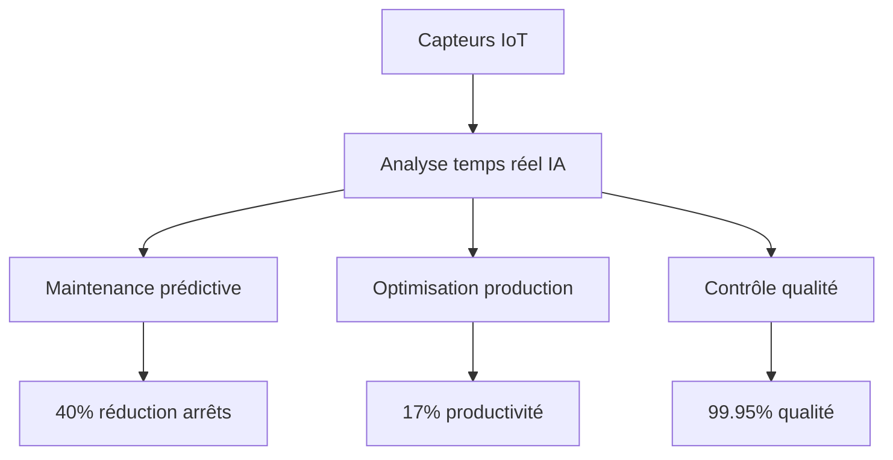

# Leçon 1.4 : Cas d'Usage Réels de l'IA

## Objectifs pédagogiques

À la fin de cette leçon, vous serez capable de :

- **Analyser** des produits IA existants et identifier le type de ML utilisé
- **Relier** les concepts abstraits (régression, classification, NLP) à des applications concrètes
- **Évaluer** la faisabilité d'un projet IA dans différents contextes métier

---

## 🎯 Accroche : Le DJ qui ne dort jamais

En 2023, Spotify a lancé une fonctionnalité qui semblait sortir d'un film de science-fiction : un **DJ personnalisé piloté par l'IA** qui connaît vos goûts musicaux mieux que vos amis.

Les résultats sont impressionnants :

- Les utilisateurs passent **25% de leur temps d'écoute** avec l'AI DJ les jours où ils l'utilisent
- **Plus de 50%** des nouveaux utilisateurs reviennent le lendemain
- La fonctionnalité augmente la rétention des abonnés de **15%**
- Spotify détient **32%** du marché mondial du streaming musical (640M utilisateurs)

> *Source : [Marketing AI Institute — How Spotify Uses AI](https://www.marketingaiinstitute.com/blog/spotify-artificial-intelligence)*

**Question :** Selon vous, quels types d'IA Spotify combine-t-il pour créer ce DJ ?

*(Réponse attendue : Recommandation (prédire quelles chansons vous plairont), NLP (générer les commentaires du DJ), synthèse vocale (créer la voix), analyse de vos comportements d'écoute...)*

L'AI DJ de Spotify combine en réalité :

- **ML de recommandation** (collaborative filtering, content-based)
- **LLMs** (OpenAI pour générer les scripts de commentaires)
- **Voix générative** (technologie Sonantic pour la synthèse vocale)
- **Personnalisation temps réel** (adaptation continue aux réactions de l'utilisateur)

Explorons maintenant les grands domaines d'application de l'IA.

---

## 4.1 Systèmes de Recommandation

### Comment ça marche ?

Un système de recommandation prédit **ce que vous aimerez** en fonction de :

- Vos comportements passés (historique)
- Les comportements de personnes similaires (collaborative filtering)
- Les caractéristiques des contenus (content-based filtering)

```
┌─────────────────────────────────────────────────────────────────────────────┐
│                    SYSTÈME DE RECOMMANDATION                                │
├─────────────────────────────────────────────────────────────────────────────┤
│                                                                             │
│  COLLABORATIVE FILTERING ("Les gens comme vous ont aimé...")               │
│                                                                             │
│  Utilisateur A : ❤️ Film1, ❤️ Film2, ❤️ Film3, ??? Film4                    │
│  Utilisateur B : ❤️ Film1, ❤️ Film2, ❤️ Film3, ❤️ Film4                    │
│  Utilisateur C : ❤️ Film1, 👎 Film2, ❤️ Film5                               │
│                                                                             │
│  → A ressemble à B → Recommander Film4 à A                                 │
│                                                                             │
│  ───────────────────────────────────────────────────────────────────────   │
│                                                                             │
│  CONTENT-BASED FILTERING ("Ce film ressemble à ceux que vous aimez")       │
│                                                                             │
│  Film1 : [Action, Sci-Fi, 2h15, Nolan]                                     │
│  Film2 : [Action, Sci-Fi, 2h30, Villeneuve]                                │
│  Film5 : [Action, Sci-Fi, 2h20, Scott]   ← Caractéristiques similaires     │
│                                                                             │
│  → Vous aimez Film1 et Film2 → Recommander Film5                           │
│                                                                             │
│  ───────────────────────────────────────────────────────────────────────   │
│                                                                             │
│  HYBRIDE : Combiner les deux approches pour de meilleurs résultats         │
│                                                                             │
└─────────────────────────────────────────────────────────────────────────────┘
```

### Exemples concrets

| Plateforme | Ce qu'elle recommande | Signal principal |
|------------|----------------------|------------------|
| **Netflix** | Films, séries | Temps de visionnage, arrêts, notes |
| **Spotify** | Musique, podcasts | Écoutes, skips, playlists |
| **Amazon** | Produits | Achats, vues, panier |
| **YouTube** | Vidéos | Watch time, likes, abonnements |
| **TikTok** | Vidéos courtes | Temps de visionnage, partages |
| **LinkedIn** | Offres d'emploi, connexions | Profil, interactions |

**Question :** Pourquoi Netflix personnalise-t-il même les vignettes (images) des films ?

*(Réponse attendue : Pour augmenter les chances de clic. Si vous aimez les comédies romantiques, la vignette montrera le couple. Si vous aimez l'action, elle montrera une scène d'action du même film.)*

<details>
<summary>🤔 Question Socratique : Les recommandations créent-elles une "bulle de filtre" ? Est-ce un problème ?</summary>

### 🔑 Réponse

**Le phénomène de "bulle de filtre" (filter bubble)** :

Si l'algorithme ne vous montre que du contenu similaire à ce que vous avez déjà aimé, vous ne découvrez jamais rien de nouveau. Vous êtes enfermé dans une "bulle" de vos propres préférences.

**Arguments que c'est un problème :**

- Réduit la sérendipité (découvertes inattendues)
- Sur les réseaux sociaux : renforce les opinions existantes
- Peut créer des chambres d'écho idéologiques

**Arguments que ce n'est pas si grave :**

- Les algorithmes modernes intègrent de la "diversité" volontairement
- Spotify a "Discover Weekly" qui pousse vers la nouveauté
- Les utilisateurs peuvent toujours chercher activement

**La solution :** Les bons systèmes de recommandation équilibrent **exploitation** (ce que vous aimez déjà) et **exploration** (vous faire découvrir du nouveau).

C'est un arbitrage que font tous les ingénieurs de recommandation.

</details>

---

## 4.2 Détection de Fraude

### Le problème

Chaque année, la fraude coûte des milliards aux institutions financières :

- **Fraude carte bancaire** : Utilisation de cartes volées
- **Usurpation d'identité** : Ouverture de comptes avec de fausses identités
- **Blanchiment d'argent** : Transactions suspectes
- **Fraude à l'assurance** : Déclarations de sinistres fictifs

### Comment l'IA détecte la fraude

C'est un problème de **classification binaire** (Fraude / Pas fraude) avec un twist : les classes sont très **déséquilibrées**.

```
┌─────────────────────────────────────────────────────────────────────────────┐
│                    DÉTECTION DE FRAUDE                                      │
├─────────────────────────────────────────────────────────────────────────────┤
│                                                                             │
│  DONNÉES :                                                                  │
│                                                                             │
│  ██████████████████████████████████████████████████  99.9% Légitimes       │
│  █                                                    0.1% Fraudes         │
│                                                                             │
│  Défi : Trouver l'aiguille dans la botte de foin !                         │
│                                                                             │
│  ───────────────────────────────────────────────────────────────────────   │
│                                                                             │
│  FEATURES UTILISÉES :                                                       │
│                                                                             │
│  • Montant de la transaction                                               │
│  • Heure de la transaction (3h du matin = suspect)                         │
│  • Localisation (pays inhabituel)                                          │
│  • Vitesse (deux transactions à 1000 km en 5 min = impossible)             │
│  • Type de marchand                                                        │
│  • Historique du client                                                    │
│  • Comportement typique vs atypique                                        │
│                                                                             │
│  ───────────────────────────────────────────────────────────────────────   │
│                                                                             │
│  DÉCISION :                                                                 │
│                                                                             │
│  Score de risque : 0.87 / 1.0  →  🚨 BLOQUER + ALERTER                     │
│  Score de risque : 0.12 / 1.0  →  ✅ APPROUVER                              │
│  Score de risque : 0.45 / 1.0  →  ⚠️ VÉRIFICATION MANUELLE                 │
│                                                                             │
└─────────────────────────────────────────────────────────────────────────────┘
```

### Le compromis Precision vs Recall

En détection de fraude, deux types d'erreurs sont possibles :

| Erreur | Nom technique | Conséquence |
|--------|---------------|-------------|
| Bloquer une transaction légitime | **Faux Positif (FP)** | Client frustré, perte de vente |
| Laisser passer une fraude | **Faux Négatif (FN)** | Perte financière, client victime |

**Question :** Si vous étiez responsable anti-fraude, préféreriez-vous minimiser les faux positifs ou les faux négatifs ? Pourquoi ?

*(Réponse attendue : Ça dépend du coût ! Bloquer 1000 € de vraie fraude peut valoir le risque d'ennuyer quelques clients. Mais bloquer trop de transactions légitimes fait fuir les clients. C'est un équilibre.)*

Ce compromis s'appelle **Precision vs Recall** — vous l'étudierez en détail au Chapitre 4.

---

## 4.3 NLP : Traitement du Langage Naturel

### Qu'est-ce que le NLP ?

**NLP (Natural Language Processing)** = Permettre aux machines de comprendre, analyser et générer du langage humain.

C'est le domaine qui a connu la plus grande révolution avec les LLMs.

### Applications du NLP

```
┌─────────────────────────────────────────────────────────────────────────────┐
│                    APPLICATIONS DU NLP                                      │
├─────────────────────────────────────────────────────────────────────────────┤
│                                                                             │
│  ┌───────────────────┐  ┌───────────────────┐  ┌───────────────────┐       │
│  │    COMPRENDRE     │  │    TRANSFORMER    │  │     GÉNÉRER       │       │
│  ├───────────────────┤  ├───────────────────┤  ├───────────────────┤       │
│  │                   │  │                   │  │                   │       │
│  │ • Classification  │  │ • Traduction      │  │ • Chatbots        │       │
│  │   de sentiments   │  │   automatique     │  │                   │       │
│  │                   │  │                   │  │ • Rédaction       │       │
│  │ • Détection de    │  │ • Résumé          │  │   automatique     │       │
│  │   spam            │  │   automatique     │  │                   │       │
│  │                   │  │                   │  │ • Code            │       │
│  │ • Extraction      │  │ • Reformulation   │  │   generation      │       │
│  │   d'entités       │  │                   │  │                   │       │
│  │                   │  │ • Correction      │  │ • Q&A             │       │
│  │ • Classification  │  │   grammaticale    │  │   automatique     │       │
│  │   de documents    │  │                   │  │                   │       │
│  └───────────────────┘  └───────────────────┘  └───────────────────┘       │
│                                                                             │
│  Évolution : BERT (2018) → GPT-3 (2020) → ChatGPT (2022) → GPT-4 (2023)   │
│                                                                             │
└─────────────────────────────────────────────────────────────────────────────┘
```

### Exemple : Analyse de sentiments

**Cas d'usage :** Une entreprise veut analyser automatiquement les avis clients.

**Input :** "Le produit est arrivé en retard et l'emballage était abîmé. Cependant, le produit lui-même fonctionne parfaitement et le service client a été très réactif."

**Output attendu :**

- Sentiment global : Mitigé (0.6 / 1.0)
- Aspects négatifs : livraison, emballage
- Aspects positifs : produit, service client

Ce type de tâche utilise :

- **Classification** (positif/négatif/neutre)
- **NER (Named Entity Recognition)** pour identifier les aspects mentionnés
- Potentiellement un **LLM** pour une analyse plus nuancée

<details>
<summary>🤔 Question Socratique : Quelle est la différence entre un chatbot "classique" et ChatGPT ?</summary>

### 🔑 Réponse

**Chatbots classiques (avant 2020) :**

- Basés sur des **règles** ou des **intentions prédéfinies**
- "Si l'utilisateur dit X, répondre Y"
- Limités aux scénarios programmés
- Incapables de gérer des questions imprévues

**Exemple :**

```
Utilisateur : "Je veux annuler ma commande"
Bot : → Détecte intention "annulation" → Répond script prédéfini
Utilisateur : "En fait, je veux la modifier plutôt"
Bot : → Confus, ne sait pas gérer ce changement
```

**ChatGPT et LLMs :**

- Génèrent des réponses **dynamiquement**
- Comprennent le **contexte** de la conversation
- Peuvent gérer des questions **jamais vues** pendant l'entraînement
- Raisonnent (ou simulent le raisonnement) sur des problèmes complexes

La différence fondamentale : les chatbots classiques **reconnaissent des patterns**, les LLMs **génèrent** du texte nouveau.

</details>

---

## 4.4 Vision par Ordinateur

### Qu'est-ce que la Computer Vision ?

**Computer Vision** = Permettre aux machines de "voir" et d'interpréter des images et vidéos.

### Applications principales

| Application | Description | Exemples |
|-------------|-------------|----------|
| **Classification d'images** | "Qu'est-ce que c'est ?" | Google Photos, diagnostic médical |
| **Détection d'objets** | "Où sont les objets ?" | Voitures autonomes, surveillance |
| **Segmentation** | "Quel pixel appartient à quoi ?" | Fond flou iPhone, imagerie médicale |
| **Reconnaissance faciale** | "Qui est-ce ?" | Face ID, recherche de personnes |
| **OCR** | "Quel texte y a-t-il ?" | Scanner de documents |
| **Génération d'images** | "Crée une image de..." | DALL-E, Midjourney, Stable Diffusion |

```
┌─────────────────────────────────────────────────────────────────────────────┐
│              NIVEAUX DE COMPLEXITÉ EN VISION PAR ORDINATEUR                 │
├─────────────────────────────────────────────────────────────────────────────┤
│                                                                             │
│  IMAGE ORIGINALE           CLASSIFICATION        DÉTECTION                  │
│  ┌─────────────┐          ┌─────────────┐       ┌─────────────┐            │
│  │  🐕    🚗   │    →     │   "Chien,   │   →   │ ┌───┐ ┌───┐ │            │
│  │      🌳    │          │   Voiture,  │       │ │🐕 │ │🚗 │ │            │
│  │  🏠        │          │   Arbre,    │       │ └───┘ └───┘ │            │
│  └─────────────┘          │   Maison"   │       │   🌳  🏠    │            │
│                           └─────────────┘       └─────────────┘            │
│                                                                             │
│  SEGMENTATION                         GÉNÉRATION                            │
│  ┌─────────────┐                     ┌─────────────┐                       │
│  │ ████  ░░░░ │                     │             │                       │
│  │   ░░ ▓▓▓▓ │  Chaque pixel       │  "Un chien  │   →   🐕 (générée)   │
│  │ ▒▒▒▒  ████ │  a une classe       │  sur une    │                       │
│  └─────────────┘                     │  plage"     │                       │
│                                      └─────────────┘                       │
│                                                                             │
└─────────────────────────────────────────────────────────────────────────────┘
```

### Focus : Véhicules autonomes

Les voitures autonomes combinent plusieurs types de vision :

1. **Détection** : Identifier piétons, véhicules, panneaux, feux
2. **Segmentation** : Distinguer la route des trottoirs
3. **Estimation de distance** : Calculer l'éloignement des objets
4. **Prédiction de mouvement** : Anticiper où iront les piétons

**Question :** Un véhicule autonome doit-il être parfait pour être utile ?

*(Réponse attendue : Non, il doit être meilleur que le conducteur humain moyen. Les humains causent ~1.35 million de morts par an sur les routes. Si l'IA réduit ce chiffre, elle est bénéfique même si elle n'est pas parfaite.)*

---

## 4.5 Analyse Prédictive

### Qu'est-ce que l'analyse prédictive ?

**Analyse prédictive** = Utiliser des données historiques pour prédire des événements futurs.

C'est l'application la plus directe du ML en entreprise.

### Cas d'usage courants

```
┌─────────────────────────────────────────────────────────────────────────────┐
│                    ANALYSE PRÉDICTIVE EN ENTREPRISE                         │
├─────────────────────────────────────────────────────────────────────────────┤
│                                                                             │
│  CHURN PREDICTION (Attrition client)                                        │
│  ──────────────────────────────────                                         │
│  Question : "Quels clients risquent de partir ?"                            │
│  Type ML : Classification binaire                                           │
│  Features : Fréquence d'usage, réclamations, ancienneté, paiements         │
│  Action : Contacter proactivement, offrir promotion                         │
│                                                                             │
│  ─────────────────────────────────────────────────────────────────────────  │
│                                                                             │
│  DEMAND FORECASTING (Prévision de demande)                                  │
│  ─────────────────────────────────────────                                  │
│  Question : "Combien vendrons-nous le mois prochain ?"                      │
│  Type ML : Régression (time series)                                         │
│  Features : Historique ventes, saisonnalité, promotions, météo             │
│  Action : Ajuster stocks, production, équipes                              │
│                                                                             │
│  ─────────────────────────────────────────────────────────────────────────  │
│                                                                             │
│  MAINTENANCE PRÉDICTIVE                                                     │
│  ─────────────────────────                                                  │
│  Question : "Quand cette machine tombera-t-elle en panne ?"                 │
│  Type ML : Régression ou classification                                     │
│  Features : Capteurs (vibration, température), âge, historique pannes      │
│  Action : Planifier maintenance avant la panne                             │
│                                                                             │
│  ─────────────────────────────────────────────────────────────────────────  │
│                                                                             │
│  SCORING CRÉDIT                                                             │
│  ─────────────                                                              │
│  Question : "Ce client remboursera-t-il son prêt ?"                         │
│  Type ML : Classification (bon/mauvais payeur)                              │
│  Features : Revenus, historique crédit, emploi, dettes                     │
│  Action : Approuver/refuser prêt, ajuster taux                             │
│                                                                             │
└─────────────────────────────────────────────────────────────────────────────┘
```

### Exemple détaillé : Prédiction du Churn

**Contexte :** Une entreprise de télécommunications perd 2% de ses clients chaque mois. Acquérir un nouveau client coûte 5x plus cher que de retenir un client existant.

**Données disponibles :**

| Client | Ancienneté | Appels support | Retards paiement | Forfait | **Churn ?** |
|--------|------------|----------------|------------------|---------|-------------|
| A | 24 mois | 0 | 0 | Premium | Non |
| B | 3 mois | 5 | 2 | Basic | Oui |
| C | 12 mois | 2 | 0 | Standard | Non |
| D | 6 mois | 8 | 3 | Basic | Oui |

**Le modèle apprend** : clients récents + nombreux appels support + retards de paiement = risque élevé de churn.

**Action :** Identifier les clients à risque → les contacter proactivement → offrir une promotion de rétention.

<details>
<summary>🤔 Question Socratique : Est-il éthique d'utiliser le ML pour décider qui mérite un prêt ?</summary>

### 🔑 Réponse

C'est une question complexe avec des arguments des deux côtés :

**Arguments en faveur :**

- Plus objectif que l'intuition humaine (qui peut être biaisée)
- Décisions cohérentes pour tous les demandeurs
- Permet d'analyser des milliers de demandes rapidement
- Peut identifier des "bons risques" que les méthodes traditionnelles auraient rejetés

**Arguments contre :**

- Le modèle peut hériter de biais historiques (si historiquement certains groupes ont été discriminés, le modèle peut perpétuer cela)
- "Black box" : difficile d'expliquer pourquoi un prêt est refusé
- Corrélations ≠ causes : le modèle peut utiliser des proxies discriminatoires (code postal → origine ethnique)

**Réglementations :**

- EU AI Act : Les systèmes de scoring crédit sont classés "haut risque"
- Droit à l'explication : Le client peut exiger de savoir pourquoi il a été refusé
- RGPD : Pas de décision entièrement automatisée sans possibilité de recours humain

La clé : **surveillance humaine**, **auditabilité**, et **tests de biais**.

</details>

---

## 🎯 Activité : Use Case Gallery

### Objectif

Analyser 5 produits IA réels pour identifier :

- Le type de ML probable (supervisé, non-supervisé, RL)
- La tâche (classification, régression, clustering, génération...)
- Les données utilisées
- La valeur business

### Les 5 produits à analyser

**Produit 1 : Google Translate**

- Interface : Texte ou image → texte traduit
- Fonctionnalité : Traduction entre 100+ langues

**Question :** Quel type de ML utilise Google Translate ?

*(Réponse attendue : Apprentissage supervisé — le modèle a été entraîné sur des millions de paires de phrases dans différentes langues. C'est de la traduction sequence-to-sequence, aujourd'hui basée sur des Transformers.)*

---

**Produit 2 : Face ID (Apple)**

- Interface : Caméra → Déverrouillage
- Fonctionnalité : Authentification biométrique

**Question :** Face ID utilise-t-il de la classification ou de la régression ?

*(Réponse attendue : Classification — le modèle doit décider si le visage est celui du propriétaire (match) ou non (pas de match). C'est une classification binaire avec un seuil de confiance très élevé.)*

---

**Produit 3 : Shazam**

- Interface : Audio → Titre de chanson
- Fonctionnalité : Identifier une musique en quelques secondes

**Question :** Comment Shazam peut-il identifier une chanson parmi des millions ?

*(Réponse attendue : Shazam crée une "empreinte audio" (fingerprint) de chaque chanson — une représentation compacte des caractéristiques audio. Quand vous enregistrez, il génère l'empreinte de votre extrait et la compare à sa base de données. C'est une recherche par similarité dans un espace de features.)*

---

**Produit 4 : Amazon "Frequently Bought Together"**

- Interface : Page produit → Suggestions de produits complémentaires
- Fonctionnalité : Vente croisée automatique

**Question :** Cela utilise-t-il du supervisé ou du non-supervisé ?

*(Réponse attendue : Les deux ! Analyse des paniers historiques (non-supervisé, recherche de patterns d'association). Prédiction de la probabilité d'achat (supervisé). Les "règles d'association" comme A → B (qui achète A achète souvent B) sont une technique classique.)*

---

**Produit 5 : Gmail "Smart Compose"**

- Interface : Rédaction d'email → Suggestions de complétion
- Fonctionnalité : Prédire la suite de votre phrase

**Question :** C'est de la classification ou de la génération ?

*(Réponse attendue : Génération de texte — le modèle prédit le prochain mot/groupe de mots le plus probable étant donné le contexte. C'est un modèle de langage (language model), l'ancêtre des LLMs actuels, mais optimisé pour la rapidité.)*

---

### Tableau récapitulatif

| Produit | Type ML | Tâche | Données | Valeur business |
|---------|---------|-------|---------|-----------------|
| Google Translate | Supervisé | Seq2Seq, génération | Paires de traductions | Accessibilité mondiale |
| Face ID | Supervisé | Classification | Scans 3D de visages | Sécurité, UX |
| Shazam | Non-supervisé + recherche | Matching | Empreintes audio | Engagement, revenus pub |
| Amazon FBT | Hybride | Association + prédiction | Historiques d'achat | +35% de revenus |
| Gmail Smart Compose | Supervisé | Génération | Emails anonymisés | Productivité, rétention |

---

---

## 4.6 Transformations Sectorielles Concrètes

L'IA ne se limite pas à des cas d'école — elle transforme des secteurs entiers de l'économie. Voyons des exemples concrets et chiffrés.

### La révolution documentaire (Droit, Finance, Compliance)

**Exemple approfondi : Analyse contractuelle juridique**

- **Processus traditionnel** : Un avocat junior passe 16 heures à analyser 500 pages de contrats
- **Avec l'IA actuelle** : Même tâche réalisée en 3-4 minutes avec 98,7% de précision
- **Technologie sous-jacente** : Transformers + RAG (Retrieval-Augmented Generation)
- **Impact économique** : Réduction de 92% des coûts de due diligence

**Cas réel : Harvey AI (déployé chez Allen & Overy)**

- 3 500 avocats formés à l'outil
- 40% de réduction du temps sur les recherches juridiques
- Capacité à analyser la jurisprudence de 50 pays simultanément

---

### La médecine augmentée

#### A. Diagnostic assisté par l'IA

```
Processus diagnostique augmenté :
1. Analyse d'image médicale → Détection de 124 pathologies (vs. 20 pour un spécialiste)
2. Croisement données patient → Prédiction de risques individuels
3. Recommandation traitement → Optimisation basée sur 2M+ de cas similaires
```

**Performance réelle en oncologie :**

| Domaine | IA | Humain | Avantage IA |
|---------|----|----|-------------|
| **Mélanomes** | 100% détection | 86% | +14 points |
| **Cancer du sein** | 94% précision | 88% | +6 points |
| **Avantage clé** | Zero fatigue, reproductibilité parfaite | — | — |

#### B. Découverte de médicaments

- **AlphaFold 3** (DeepMind) : Prédit les interactions protéine-médicament
- **Impact** : Réduction de 3-5 ans sur le développement de nouveaux médicaments
- **Exemple concret** : Découverte d'un antibiotique contre les bactéries résistantes en 48h (vs. années traditionnellement)

---

### L'usine intelligente 4.0

**Pilier de la 4ème révolution industrielle :**



**Cas Siemens MindSphere :**

- 1 200 usines connectées
- 45% de réduction des temps d'arrêt
- ROI moyen : 14 mois

---

### Le développement logiciel transformé

**La programmation augmentée** est devenue la norme :

| Outil | Usage quotidien | Impact productivité |
|-------|-----------------|---------------------|
| **GitHub Copilot** | 58% des développeurs | +55% de vitesse de code |
| **ChatGPT Code** | 42% des développeurs | -70% temps de débogage |
| **Claude Code** | 35% des développeurs | +40% qualité du code |

**Nouveau paradigme du développeur :**

- **Développeur 2020** : 70% codage, 30% conception
- **Développeur 2025** : 30% codage, 40% prompt engineering, 30% validation

**Impact économique** : 100 millions de lignes de code générées quotidiennement par l'IA

<details>
<summary>🤔 Question Socratique : Si l'IA peut coder, pourquoi apprendre à programmer ?</summary>

### 🔑 Réponse

Excellente question qui revient souvent ! Voici pourquoi la programmation reste essentielle :

1. **Comprendre pour vérifier** : L'IA génère du code, mais vous devez être capable de le relire, de détecter les bugs, et de valider qu'il fait ce que vous voulez.

2. **Le prompt est le nouveau code** : Pour donner de bonnes instructions à l'IA, il faut comprendre les concepts de programmation (algorithmes, structures de données, architecture).

3. **L'IA amplifie, elle ne remplace pas** : Un développeur junior + IA ≠ développeur senior. L'IA accélère l'exécution, pas la réflexion architecturale.

4. **Évolution constante** : Les frameworks, langages et patterns évoluent. L'IA a été entraînée sur le passé — vous devez comprendre le présent.

**Analogie** : La calculatrice n'a pas rendu les mathématiques obsolètes. Elle a permis de se concentrer sur des problèmes plus complexes.

</details>

---

## Résumé de la leçon

### Les 6 grands domaines d'application

1. **Recommandation** : Prédire ce que vous aimerez (Netflix, Spotify, Amazon)
2. **Détection de fraude** : Classification sur données déséquilibrées
3. **NLP** : Comprendre et générer du langage (chatbots, traduction)
4. **Vision** : Interpréter images et vidéos (voitures autonomes, diagnostic médical)
5. **Analyse prédictive** : Prévoir des événements business (churn, demande)
6. **Transformations sectorielles** : Droit, médecine, industrie, développement logiciel

### Pattern commun

Tous ces cas suivent le même schéma :

```
Problème business → Données historiques → Modèle ML → Prédiction → Action → Valeur
```

---

## Réflexion métacognitive

Avant de passer à la suite :

1. **Quel cas d'usage vous a le plus surpris par sa sophistication ?**

2. **Pouvez-vous identifier un problème dans votre domaine qui pourrait bénéficier de l'IA ?**

3. **Quelle question vous posez-vous encore sur le fonctionnement de ces systèmes ?**

---

## Pour aller plus loin (optionnel)

- 📺 [How Netflix's Recommendations Work](https://www.youtube.com/watch?v=5dTOPen28ts) — Explication visuelle
- 🎧 [How Shazam Works](https://www.toptal.com/algorithms/shazam-it-music-processing-fingerprinting-and-recognition) — Article technique
- 📊 [Papers With Code](https://paperswithcode.com/) — State-of-the-art sur tous les benchmarks ML
