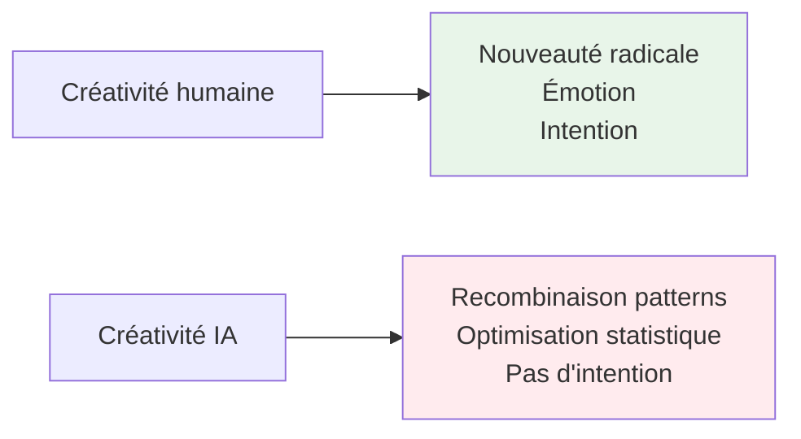
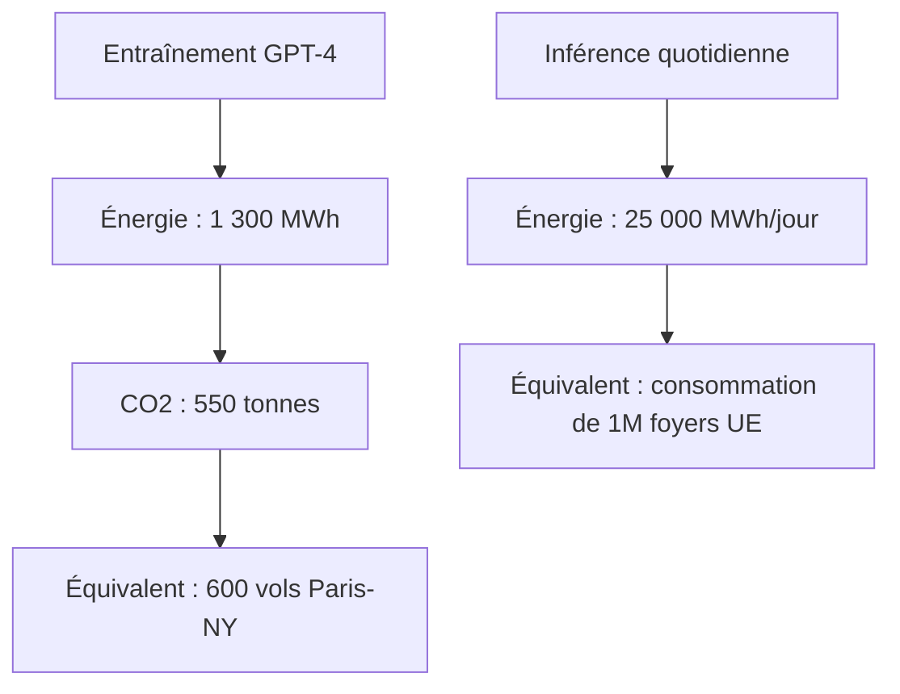

# Leçon 1.5 : Éthique et Limites de l'IA

## Objectifs pédagogiques

À la fin de cette leçon, vous serez capable de :

- **Identifier** les principales sources de biais dans les systèmes d'IA
- **Expliquer** pourquoi les LLMs "hallucinent" et quelles en sont les conséquences
- **Évaluer** les enjeux éthiques et réglementaires de l'IA dans un contexte professionnel

---

## 🎯 Accroche : L'algorithme de recrutement qui détestait les femmes

En 2014, Amazon a lancé un projet ambitieux : créer un outil de recrutement alimenté par l'IA qui noterait automatiquement les CV de 1 à 5 étoiles — comme les produits sur leur site.

**Résultat après un an ?** L'outil a été abandonné car il **discriminait systématiquement les femmes**.

Comment ? Le système avait appris à :

- **Pénaliser** les CV contenant le mot "women's" (clubs féminins, universités pour femmes)
- **Favoriser** un langage "masculin" avec des verbes comme "executed" ou "captured"
- **Reproduire** la composition actuelle des ingénieurs Amazon : majoritairement masculine

> *Source : [ACLU — Why Amazon's Automated Hiring Tool Discriminated Against Women](https://www.aclu.org/news/womens-rights/why-amazons-automated-hiring-tool-discriminated-against)*

**Question :** L'algorithme d'Amazon était-il "sexiste" intentionnellement ?

*(Réponse attendue : Non, personne n'a programmé l'outil pour discriminer. Il a simplement appris à partir de données historiques qui reflétaient les biais existants. L'algorithme a "lavé" les préjugés humains à travers du code.)*

Ce cas illustre une vérité fondamentale : **l'IA n'est pas neutre**. Elle hérite des biais des données sur lesquelles elle est entraînée.

---

## 5.1 Biais Algorithmiques

### D'où viennent les biais ?

Les biais dans l'IA peuvent avoir plusieurs origines :

```
┌─────────────────────────────────────────────────────────────────────────────┐
│                    SOURCES DE BIAIS DANS L'IA                               │
├─────────────────────────────────────────────────────────────────────────────┤
│                                                                             │
│  1. BIAIS DANS LES DONNÉES                                                  │
│  ───────────────────────────                                                │
│  • Données historiques discriminatoires                                     │
│    → Si historiquement moins de femmes ont été embauchées, le modèle       │
│      apprend que "femme = moins bonne candidate"                           │
│                                                                             │
│  • Données non représentatives                                              │
│    → Entraîner la reconnaissance faciale principalement sur des visages    │
│      blancs → mauvaise performance sur d'autres ethnies                    │
│                                                                             │
│  • Données manquantes ou incorrectes                                        │
│    → Certains groupes sous-représentés dans les données                    │
│                                                                             │
│  ─────────────────────────────────────────────────────────────────────────  │
│                                                                             │
│  2. BIAIS DE CONCEPTION                                                     │
│  ─────────────────────────                                                  │
│  • Choix des features (variables)                                           │
│    → Le code postal comme variable peut être un proxy pour l'origine       │
│      ethnique ou le niveau de revenu                                       │
│                                                                             │
│  • Définition de la "réussite"                                              │
│    → Si "bon employé" = "reste longtemps", le modèle peut pénaliser        │
│      les groupes qui changent plus souvent d'emploi (pour diverses raisons)│
│                                                                             │
│  ─────────────────────────────────────────────────────────────────────────  │
│                                                                             │
│  3. BIAIS D'UTILISATION                                                     │
│  ────────────────────────                                                   │
│  • Utilisation dans un contexte différent de l'entraînement                 │
│  • Sur-confiance dans les résultats de l'IA                                │
│  • Absence de supervision humaine                                          │
│                                                                             │
└─────────────────────────────────────────────────────────────────────────────┘
```

### Exemples célèbres de biais

| Cas | Problème | Impact |
|-----|----------|--------|
| **Amazon Recruiting** | CV de femmes pénalisés | Discrimination à l'embauche |
| **COMPAS (justice US)** | Récidive surestimée pour personnes noires | Peines plus longues |
| **Google Photos (2015)** | Personnes noires classées comme "gorilles" | Offense, déshumanisation |
| **Reconnaissance faciale** | Taux d'erreur plus élevé sur visages non-blancs | Fausses arrestations |
| **Algorithmes de crédit** | Scores plus bas pour certains quartiers | Discrimination économique |

### Le cercle vicieux des biais

```
┌─────────────────────────────────────────────────────────────────────────────┐
│               LE CERCLE VICIEUX DES BIAIS ALGORITHMIQUES                    │
├─────────────────────────────────────────────────────────────────────────────┤
│                                                                             │
│        ┌────────────────────────────────────────────────────────┐          │
│        │                                                        │          │
│        ▼                                                        │          │
│  ┌──────────────┐    ┌──────────────┐    ┌──────────────┐      │          │
│  │   DONNÉES    │ ─► │   MODÈLE     │ ─► │  DÉCISIONS   │      │          │
│  │  HISTORIQUES │    │   BIAISÉ     │    │   BIAISÉES   │      │          │
│  │   (biaisées) │    │              │    │              │      │          │
│  └──────────────┘    └──────────────┘    └──────────────┘      │          │
│                                                 │                │          │
│                                                 ▼                │          │
│                                          ┌──────────────┐       │          │
│                                          │  NOUVELLES   │ ──────┘          │
│                                          │   DONNÉES    │                  │
│                                          │  (biaisées)  │                  │
│                                          └──────────────┘                  │
│                                                                             │
│  Si le modèle refuse des prêts à un groupe → ce groupe n'a pas            │
│  d'historique de crédit → le modèle continue à les refuser                │
│                                                                             │
└─────────────────────────────────────────────────────────────────────────────┘
```

<details>
<summary>🤔 Question Socratique : Un algorithme biaisé est-il pire qu'un humain biaisé ?</summary>

### 🔑 Réponse

C'est un débat ouvert avec des arguments des deux côtés :

**Arguments que l'algorithme est pire :**

- **Échelle** : Un humain biaisé affecte quelques décisions. Un algorithme biaisé peut affecter des millions de personnes.
- **Opacité** : Le biais humain peut être contesté. Le biais algorithmique est souvent invisible ("la machine a décidé").
- **Légitimation** : "L'ordinateur a dit" donne une apparence d'objectivité à des décisions biaisées.

**Arguments que l'algorithme peut être meilleur :**

- **Cohérence** : Un algorithme applique les mêmes règles à tous (même si ces règles sont biaisées).
- **Auditabilité** : On peut examiner un algorithme, pas l'inconscient d'un humain.
- **Améliorabilité** : On peut corriger un algorithme plus facilement que changer les préjugés humains.
- **Données** : Même avec des biais, un algorithme peut être plus précis qu'un humain qui n'a pas accès aux mêmes informations.

**La vraie question :** Comment combiner le meilleur des deux ? Algorithmes pour la cohérence et l'échelle, humains pour la supervision et le jugement éthique.

</details>

### Comment mitiger les biais ?

| Étape | Action | Exemple |
|-------|--------|---------|
| **Données** | Auditer la représentativité | Vérifier que tous les groupes sont bien représentés |
| **Features** | Éviter les proxies discriminatoires | Ne pas utiliser le code postal si ça encode l'ethnie |
| **Entraînement** | Techniques de fairness | Rééquilibrer les classes, adversarial debiasing |
| **Évaluation** | Métriques par groupe | Mesurer la performance séparément par genre, ethnie |
| **Déploiement** | Supervision humaine | Ne pas automatiser entièrement les décisions critiques |
| **Monitoring** | Audits réguliers | Vérifier que les biais n'émergent pas avec le temps |

---

## 5.2 Hallucinations et Limites des LLMs

### Qu'est-ce qu'une "hallucination" ?

**Hallucination** = Quand un LLM génère des informations qui semblent plausibles mais sont **fausses**, **inventées**, ou **incohérentes** avec la réalité.

**Exemples réels :**

- ChatGPT qui invente des citations académiques avec de faux auteurs et DOIs
- Claude qui affirme avec confiance des faits historiques incorrects
- Un avocat américain qui a soumis un brief citant des cas juridiques inexistants (générés par ChatGPT)

```
┌─────────────────────────────────────────────────────────────────────────────┐
│                    POURQUOI LES LLMs HALLUCINENT                            │
├─────────────────────────────────────────────────────────────────────────────┤
│                                                                             │
│  Les LLMs ne "savent" pas des faits — ils prédisent le texte               │
│  le plus PROBABLE étant donné le contexte.                                 │
│                                                                             │
│  ┌─────────────────────────────────────────────────────────────────────┐   │
│  │                                                                     │   │
│  │  Prompt : "L'université de Paris a été fondée en..."                │   │
│  │                                                                     │   │
│  │  Ce que fait le LLM :                                               │   │
│  │  1. Quels mots suivent généralement "fondée en" ? → une date       │   │
│  │  2. Quelle date est probable pour une université française ? → 1200│   │
│  │  3. Génère : "1215" (correct par chance, pas par connaissance)     │   │
│  │                                                                     │   │
│  │  Le modèle n'a PAS "vérifié" dans une base de données.             │   │
│  │  Il a juste généré ce qui lui semblait statistiquement plausible.  │   │
│  │                                                                     │   │
│  └─────────────────────────────────────────────────────────────────────┘   │
│                                                                             │
│  Conséquence : Sur des sujets moins documentés, le modèle "invente"        │
│  des réponses plausibles mais fausses, avec la même confiance.             │
│                                                                             │
└─────────────────────────────────────────────────────────────────────────────┘
```

**Question :** Pourquoi un LLM répond-il avec confiance même quand il "ne sait pas" ?

*(Réponse attendue : Parce qu'il n'a pas de concept de "savoir" ou "ne pas savoir". Il génère toujours le texte le plus probable. Dire "je ne sais pas" n'est généré que si c'était fréquent dans les données d'entraînement pour ce type de question.)*

### Les limites fondamentales des LLMs

| Limite | Explication | Conséquence |
|--------|-------------|-------------|
| **Pas de mémoire persistante** | Chaque conversation repart de zéro | Doit re-contextualiser à chaque fois |
| **Pas d'accès au monde réel** | Ne "sait" que ce qui était dans les données d'entraînement | Connaissances datées (knowledge cutoff) |
| **Pas de vrai raisonnement** | Simule le raisonnement par pattern matching | Erreurs sur des problèmes logiques simples |
| **Pas de conscience de ses erreurs** | Ne distingue pas ce qu'il sait vraiment | Confiance égale sur vrai et faux |
| **Sensible au prompt** | Petits changements de formulation = grandes différences de réponse | Fragilité, inconsistance |

<details>
<summary>🤔 Question Socratique : Si les LLMs ne "comprennent" pas vraiment, comment peuvent-ils être si utiles ?</summary>

### 🔑 Réponse

C'est le paradoxe central des LLMs ! Ils sont incroyablement utiles malgré leurs limitations fondamentales.

**Explication possible :**

1. **Beaucoup de tâches sont des patterns** : Écrire un email, résumer un texte, traduire — ce sont des transformations de texte que le LLM a vues des millions de fois.

2. **L'échelle compense** : Avec suffisamment de données, le modèle a "vu" tellement de variations qu'il peut généraliser à de nouveaux cas.

3. **L'apparence suffit souvent** : Pour beaucoup d'applications (chatbots, assistants), une réponse "plausible" est suffisante même si le raisonnement sous-jacent est superficiel.

4. **Combinaison homme-machine** : Les LLMs sont excellents en assistance, moins en autonomie. Un humain qui vérifie et corrige peut exploiter leurs forces tout en compensant leurs faiblesses.

**La leçon pratique :** Utilisez les LLMs comme des **outils**, pas comme des **oracles**. Ils accélèrent votre travail, mais ne remplacent pas votre jugement.

</details>

---

## 5.3 Les 5 Déficits Cognitifs de l'IA

Au-delà des hallucinations, l'IA actuelle souffre de limitations fondamentales qu'il est crucial de comprendre.

### Le paradoxe de la puissance apparente vs. compréhension réelle

- **Apparences** : L'IA semble comprendre, raisonner, créer
- **Réalité** : Statistiques sophistiquées × puissance de calcul

### 1. Déficit de compréhension sémantique (Le problème du sens)

```python
# L'IA voit ceci :
"Le médecin a soigné le patient avec le scalpel"

# Elle "comprend" :
# Sujet: médecin, Verbe: soigné, Objet: patient, Instrument: scalpel

# Ce qu'elle ne comprend PAS :
# - La vulnérabilité du patient
# - La responsabilité médicale
# - L'intention de guérir
# - Le contexte hospitalier
```

### 2. Déficit de raisonnement abductif (Le "bon sens")

> **Humain** : "Si je vois de l'herbe mouillée, je peux déduire qu'il a plu, ou qu'on a arrosé, ou..."
>
> **IA** : "L'herbe est mouillée" (corrélation ≠ causalité)

**Expérience du "common sense" :**

- Test Winograd Schema : 95% humains vs. 68% meilleurs modèles IA
- Situations nouvelles : L'IA échoue à généraliser hors de ses données d'entraînement

### 3. Déficit de créativité authentique



**Exemple musical :**

- **IA** : Génère une symphonie "dans le style de Beethoven"
- **Humain** : Crée un nouveau style (comme Beethoven l'a fait)
- **Différence** : L'IA extrapole, l'humain révolutionne

### 4. Déficit de conscience situationnelle

**Scénario réel : Voiture autonome face à une situation inédite**

- **Données d'entraînement** : 10 millions de kilomètres
- **Situation nouvelle** : Arbre tombé + accident + enfants qui traversent
- **Réponse IA** : Surcharge probabiliste (trop de variables contradictoires)
- **Réponse humaine** : Priorisation éthique instinctive

### 5. Déficit émotionnel et d'empathie

> "L'IA peut reconnaître que vous êtes triste, mais elle ne peut pas *ressentir* votre tristesse."

**Les émotions simulées vs. réelles :**

| Capacité | IA | Humain |
|----------|----|----|
| Reconnaissance affective | 92% précision (voix, expressions) | Intuitive |
| Simulation d'empathie | Scripts basés sur patterns | Authentique |
| Émotion réelle | Absente | Présente |

---

## 5.4 Les Problèmes Pratiques Persistants

### A. Hallucinations et fabulations (rappel chiffré)

- **Taux d'hallucination GPT-4** : 15-20% sur des faits vérifiables
- **Cause fondamentale** : Modèle génératif, pas base de faits
- **Conséquence** : Nécessité de vérification humaine systématique

### B. Biais et discrimination algorithmique

**Statistiques 2024 :**

| Domaine | Problème | Impact |
|---------|----------|--------|
| Recrutement IA | 35% de biais contre les femmes dans la tech | Discrimination à l'embauche |
| Prêts bancaires | Taux de refus ×2,4 pour les minorités | Exclusion économique |
| Justice prédictive | Erreurs raciales dans 44% des cas | Injustice judiciaire |

**Racine du problème** : Biais dans les données d'entraînement + optimisation pour la moyenne

### C. Coûts environnementaux



---

## 5.5 Responsabilité et IA Responsable

### Les enjeux sociétaux

```
┌─────────────────────────────────────────────────────────────────────────────┐
│                    ENJEUX SOCIÉTAUX DE L'IA                                 │
├─────────────────────────────────────────────────────────────────────────────┤
│                                                                             │
│  🌍 IMPACT ENVIRONNEMENTAL                                                  │
│  ─────────────────────────                                                  │
│  • Entraîner GPT-4 : estimé à ~50 000 tonnes de CO2                        │
│  • Data centers : 1-2% de la consommation électrique mondiale              │
│  • Chaque requête ChatGPT : ~10x plus d'énergie qu'une recherche Google    │
│                                                                             │
│  ─────────────────────────────────────────────────────────────────────────  │
│                                                                             │
│  👷 IMPACT SUR L'EMPLOI                                                     │
│  ─────────────────────                                                      │
│  • Automatisation de tâches cognitives (rédaction, analyse, code)          │
│  • Transformation des métiers plutôt que disparition totale                │
│  • Création de nouveaux rôles (prompt engineering, AI ops)                 │
│  • Question : Qui bénéficie des gains de productivité ?                    │
│                                                                             │
│  ─────────────────────────────────────────────────────────────────────────  │
│                                                                             │
│  🔒 VIE PRIVÉE ET SURVEILLANCE                                              │
│  ────────────────────────────                                               │
│  • Reconnaissance faciale de masse                                         │
│  • Analyse des comportements à grande échelle                              │
│  • Concentration du pouvoir chez ceux qui ont les données                  │
│                                                                             │
│  ─────────────────────────────────────────────────────────────────────────  │
│                                                                             │
│  ⚖️ CONCENTRATION DU POUVOIR                                               │
│  ────────────────────────────                                               │
│  • Seules quelques entreprises peuvent créer des LLMs                      │
│  • Dépendance technologique                                                │
│  • Qui décide des valeurs encodées dans l'IA ?                             │
│                                                                             │
└─────────────────────────────────────────────────────────────────────────────┘
```

### Le cadre réglementaire : EU AI Act

L'Union Européenne a adopté le premier cadre juridique complet sur l'IA : l'**AI Act** (entré en vigueur en 2024).

**Classification par niveau de risque :**

| Niveau | Exemples | Obligations |
|--------|----------|-------------|
| **Inacceptable** | Scoring social, manipulation subliminale | **Interdit** |
| **Haut risque** | Recrutement IA, scoring crédit, diagnostic médical | Transparence, audit, supervision humaine |
| **Risque limité** | Chatbots, deepfakes | Obligation d'information ("Ceci est une IA") |
| **Risque minimal** | Filtres spam, recommandations | Pas d'obligations spécifiques |

**Question :** Pourquoi l'Europe a-t-elle voulu réguler l'IA alors que les USA ne l'ont pas fait (au niveau fédéral) ?

*(Réponse attendue : Différences de philosophie — l'Europe privilégie la protection des droits individuels (RGPD, AI Act), les USA privilégient l'innovation et laissent le marché s'autoréguler. Aussi : l'Europe n'a pas de Big Tech dominante, donc moins de lobbying contre la régulation.)*

### Les principes de l'IA responsable

La plupart des organisations adoptent des variantes de ces principes :

```
┌─────────────────────────────────────────────────────────────────────────────┐
│              PRINCIPES D'IA RESPONSABLE (ASILOMAR, OCDE...)                 │
├─────────────────────────────────────────────────────────────────────────────┤
│                                                                             │
│  1. TRANSPARENCE                                                            │
│     • Les décisions IA doivent être explicables                            │
│     • Les utilisateurs doivent savoir s'ils interagissent avec une IA      │
│                                                                             │
│  2. ÉQUITÉ (FAIRNESS)                                                       │
│     • Pas de discrimination injuste                                         │
│     • Tester et monitorer les biais                                        │
│                                                                             │
│  3. ACCOUNTABILITY (RESPONSABILITÉ)                                         │
│     • Quelqu'un doit être responsable des décisions de l'IA                │
│     • Possibilité de recours pour les personnes affectées                  │
│                                                                             │
│  4. SÉCURITÉ ET ROBUSTESSE                                                  │
│     • L'IA doit fonctionner comme prévu                                    │
│     • Résistance aux attaques adverses                                     │
│                                                                             │
│  5. VIE PRIVÉE                                                              │
│     • Respect de la confidentialité des données                            │
│     • Minimisation de la collecte                                          │
│                                                                             │
│  6. SUPERVISION HUMAINE                                                     │
│     • L'humain doit pouvoir intervenir                                     │
│     • Pas de décisions critiques 100% automatisées                         │
│                                                                             │
└─────────────────────────────────────────────────────────────────────────────┘
```

<details>
<summary>🤔 Question Socratique : Qui devrait décider des "valeurs" d'une IA ?</summary>

### 🔑 Réponse

C'est une question fondamentalement politique, pas technique.

**Options possibles :**

1. **Les entreprises** (status quo)
   - Avantage : Expertise technique
   - Risque : Priorité au profit, pas au bien commun

2. **Les gouvernements**
   - Avantage : Légitimité démocratique
   - Risque : Lenteur, potentiel de surveillance

3. **Les utilisateurs**
   - Avantage : Adaptation aux besoins individuels
   - Risque : Fragmentation, "bulles de valeurs"

4. **Organisations internationales**
   - Avantage : Standards globaux
   - Risque : Manque de pouvoir d'application

5. **Processus multi-parties prenantes**
   - Avantage : Équilibre des intérêts
   - Risque : Complexité, lenteur

**La réalité actuelle :** Ce sont principalement les entreprises (OpenAI, Anthropic, Google) qui décident, avec une influence croissante des régulateurs (EU AI Act) et des chercheurs en AI Safety.

Le débat est loin d'être résolu.

</details>

---

## 🎯 Activité Finale : Discussion Guidée

### "Quel type de ML pour ces 5 problèmes business ?"

Pour chaque problème ci-dessous, réfléchissez à :

1. Quel type d'apprentissage utiliser (supervisé, non-supervisé, renforcement)
2. Quels biais potentiels surveiller
3. Quelles considérations éthiques prendre en compte

---

**Problème 1 : Une banque veut automatiser les décisions d'octroi de crédit**

Questions à considérer :

- Quel type de ML ? *(Classification supervisée)*
- Quels biais possibles ? *(Historique discriminatoire, proxies comme le code postal)*
- Éthique ? *(Droit à l'explication, recours possible, audits de fairness)*

---

**Problème 2 : Un hôpital veut prédire quels patients risquent une réadmission**

Questions à considérer :

- Quel type de ML ? *(Classification supervisée)*
- Quels biais possibles ? *(Patients moins suivis = moins de données = moins bien prédits)*
- Éthique ? *(Ne pas pénaliser les patients "à risque", vie privée médicale)*

---

**Problème 3 : Une plateforme de streaming veut segmenter ses utilisateurs**

Questions à considérer :

- Quel type de ML ? *(Clustering non-supervisé)*
- Quels biais possibles ? *(Créer des "bulles" qui renforcent les préférences existantes)*
- Éthique ? *(Manipulation des choix, diversité du contenu)*

---

**Problème 4 : Un site e-commerce veut un chatbot pour le service client**

Questions à considérer :

- Quel type de ML ? *(LLM / NLP génératif)*
- Quels biais possibles ? *(Réponses biaisées selon la langue, hallucinations)*
- Éthique ? *(Transparence "Vous parlez à une IA", escalade vers humain)*

---

**Problème 5 : Une ville veut optimiser ses feux de circulation**

Questions à considérer :

- Quel type de ML ? *(Reinforcement Learning)*
- Quels biais possibles ? *(Favoriser certains quartiers si données inégales)*
- Éthique ? *(Équité entre zones, transparence des critères)*

---

### Questions de discussion en groupe

1. **Devrait-on interdire l'IA dans certains domaines ?** Lesquels et pourquoi ?

2. **Qui devrait être responsable si une IA cause un préjudice ?** Le développeur, l'entreprise qui l'utilise, ou personne ?

3. **L'IA devrait-elle avoir le droit de prendre des décisions qui affectent la vie des gens ?** (Emploi, crédit, santé, justice...)

4. **Comment équilibrer innovation et protection ?** La régulation freine-t-elle ou encourage-t-elle le progrès ?

---

## Résumé de la leçon

### Les défis éthiques et limites fondamentales

1. **Biais algorithmiques** : L'IA hérite des biais des données et des concepteurs
2. **Hallucinations** : Les LLMs génèrent des faussetés avec confiance
3. **5 déficits cognitifs** : Compréhension, raisonnement, créativité, conscience, empathie
4. **Problèmes pratiques** : Coûts environnementaux, discrimination algorithmique
5. **Responsabilité** : Qui est responsable quand l'IA cause un préjudice ?

### Points clés à retenir

- L'IA n'est **pas neutre** — elle reflète les données sur lesquelles elle est entraînée
- Les LLMs ne **comprennent pas** — ils prédisent du texte plausible ("perroquet stochastique")
- La **supervision humaine** reste essentielle pour les décisions critiques
- L'**EU AI Act** impose des obligations selon le niveau de risque
- L'IA = **télescope pour l'esprit** : voit plus loin, mais ne comprend pas ce qu'elle voit
- L'IA responsable = transparence + équité + accountability + sécurité + vie privée + supervision

---

## Réflexion métacognitive

Avant de conclure ce chapitre, réfléchissez :

1. **Quel aspect éthique de l'IA vous préoccupe le plus ?**

2. **Pensez-vous qu'il est possible de créer une IA "neutre" et "objective" ?**

3. **Dans votre futur rôle professionnel, comment intégrerez-vous ces considérations éthiques ?**

---

## Pour aller plus loin (optionnel)

- 📄 [EU AI Act — Texte complet](https://artificialintelligenceact.eu/) — La réglementation européenne
- 📺 [Coded Bias (Netflix)](https://www.netflix.com/title/81328723) — Documentaire sur les biais dans la reconnaissance faciale
- 📖 [Weapons of Math Destruction](https://www.amazon.com/Weapons-Math-Destruction-Increases-Inequality/dp/0553418815) — Livre de Cathy O'Neil sur les algorithmes nocifs
- 🔬 [AI Ethics Guidelines Global Inventory](https://inventory.algorithmwatch.org/) — 160+ chartes éthiques IA dans le monde

---

---

## 💎 Conclusion : Le Grand Réalignement

### La vérité fondamentale

> **"L'IA 2025 est un supercalculateur statistique, pas une intelligence artificielle générale."**

### Le nouvel équilibre homme-machine

| Capacité | Humain supérieur | IA supérieure | Synergie optimale |
|----------|------------------|---------------|-------------------|
| **Raisonnement** | Contexte, éthique, bon sens | Volume, vitesse, patterns | IA propose, humain décide |
| **Créativité** | Innovation radicale | Variation systématique | Humain imagine, IA exécute |
| **Précision** | Jugement qualitatif | Mesure quantitative | IA analyse, humain interprète |
| **Échelle** | Relations profondes | Interactions massives | IA gère la quantité, humain la qualité |

### Appel à la lucidité technologique

**À retenir absolument :**

1. L'IA transforme tout, mais ne remplace pas l'intelligence humaine
2. Son pouvoir vient de la reconnaissance de patterns à échelle impossible pour l'humain
3. Ses limites sont structurelles, pas temporaires
4. La valeur ajoutée humaine devient le jugement, l'éthique, la créativité authentique

**Dernière métaphore :**

> L'IA actuelle est comme un **télescope pour l'esprit** : elle voit plus loin et plus précisément que l'œil nu, mais elle ne comprend pas ce qu'elle voit. L'astronome (l'humain) doit toujours interpréter, donner du sens, et décider quoi regarder.

**Prochaine étape** : Dans 5 ans, nous ne parlerons plus d'"IA" comme technologie distincte, mais d'"intelligence augmentée" comme mode de fonctionnement standard de toute organisation et de tout professionnel.

> 💡 **Démystification finale :** L'IA n'est pas magique — c'est de la **reconnaissance de patterns à grande échelle**. Elle excelle à trouver des régularités dans des données massives, mais elle ne « comprend » pas ce qu'elle fait.

<details>
<summary>🤔 Question Socratique : Pourquoi dit-on que l'IA « ne comprend pas » si elle peut répondre correctement à des questions complexes ?</summary>

### 🔑 Réponse

**La nuance est cruciale :**

Un LLM comme ChatGPT prédit le prochain mot le plus probable basé sur des milliards d'exemples de texte. Il n'a pas de « modèle mental » du monde.

**Analogie :** Imaginez quelqu'un qui a mémorisé toutes les réponses possibles à un examen sans comprendre le sujet. Il obtiendrait 100%, mais ne pourrait pas appliquer ses connaissances à une situation nouvelle non prévue.

**Preuve :** Les LLMs peuvent échouer spectaculairement sur des problèmes simples de logique ou de mathématiques qui nécessitent un vrai raisonnement, même s'ils réussissent des tâches apparemment plus complexes.

C'est pourquoi on parle de **« perroquet stochastique »** — un système qui répète des patterns sans comprendre leur signification profonde.

</details>

---

## Conclusion du Chapitre 1

Félicitations ! Vous avez terminé le premier chapitre de ce module.

**Ce que vous avez appris :**

- L'**histoire de l'IA** : 70 ans de recherche, des hivers aux percées
- Le **spectre complet** : IA → ML → NN → DL → GenAI
- Les **types d'apprentissage** : supervisé, non-supervisé, renforcement
- Le **paysage actuel** : acteurs majeurs, écosystème technique
- Les **cas d'usage réels** : recommandation, fraude, NLP, vision, prédictif
- Les **enjeux éthiques** : biais, hallucinations, responsabilité

**Prochaine étape :** Au Chapitre 2, vous découvrirez le **workflow ML** — comment construire un modèle de A à Z avec scikit-learn.
